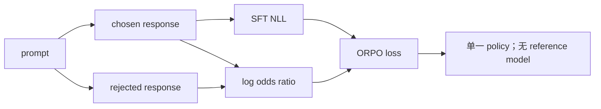
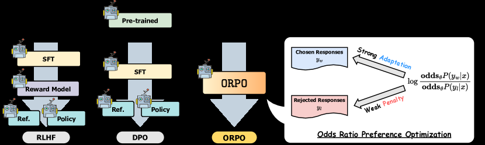

# ORPO：把偏好 odds 直接并入 SFT

> ORPO 用一个模型同时完成监督学习与偏好拉开，不需要冻结 reference model。

## 论文信息

| 字段 | 内容 |
|---|---|
| 论文链接 | [ORPO: Monolithic Preference Optimization without Reference Model](https://arxiv.org/abs/2403.07691) |
| 公司 / 机构 | KAIST |
| 首次公开日期 | 2024-03-12 |
| 原作者代码 | [已开源：xfactlab/orpo](https://github.com/xfactlab/orpo) |
| 本地 adapter / CLI key | `orpo` |
| 本地复现代码 | `src/auto_research/post_training/` |

## 原始论文总结

### 背景与主要改动

常见对齐流程先 SFT、再用 reference-relative 偏好目标训练。ORPO 把 chosen response 的
NLL 与 chosen/rejected 的 odds-ratio penalty 合成一个目标；概率接近 0 或 1 时，odds
会提供比普通概率差更敏感的对比信号。



<!-- paper-figure:start -->
### 原论文关键图

[](https://ar5iv.labs.arxiv.org/html/2403.07691/assets/x2.png)

> **原论文 Figure 2（关键图）**：展示原论文方法的总体设计和关键组成。图片来自[原论文](https://arxiv.org/abs/2403.07691)，版权归原作者所有；点击图片可查看来源。
<!-- paper-figure:end -->

### 核心公式

$$
\operatorname{odds}_\theta(y|x)=
\frac{\pi_\theta(y|x)}{1-\pi_\theta(y|x)},
$$

$$
\mathcal L_{\mathrm{ORPO}}=
\mathcal L_{\mathrm{SFT}}(y_w)
-\lambda\log\sigma\!\left(
\log\frac{\operatorname{odds}_\theta(y_w|x)}
{\operatorname{odds}_\theta(y_l|x)}
\right).
$$

### 论文离线与线上效果

论文的 Mistral-ORPO-$\beta$ 在 AlpacaEval 2.0 达到 12.20%，IFEval 66.19%，
MT-Bench 7.32；均为离线评测，没有生产线上 A/B 实验。

## 本地复现

| 指标 | 未训练策略 | ORPO |
|---|---:|---:|
| accuracy | 0.1641 | **0.8438** |
| mean reward | 0.3126 | **0.8618** |
| KL(reference，仅诊断) | 0.0000 | 0.8973 |

最后一步 SFT NLL 为 0.0715、chosen/rejected log-odds margin 为 6.3502；训练目标
没有 reference model 参数。

```bash
auto-research post-train --algorithm orpo \
  --dataset gsm8k-candidate --maximum-examples 512 \
  --steps 300 --seed 42 --offline
```

稳定指标：
[`classic-post-training-gsm8k-seed42.json`](../../experiments/classic-post-training-gsm8k-seed42.json)。

## 复现边界

实现了 chosen SFT 与 odds-ratio preference penalty 的单阶段更新；本地把完整候选视为
response action，未训练论文中的 Mistral/Llama 模型，KL 只用于统一报告而不参与目标。
