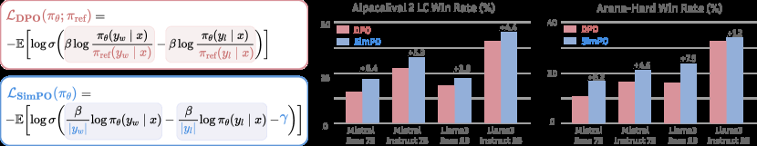

# SimPO

> 用长度归一化的 policy log-probability 直接作 reward，并用目标 margin 拉开偏好。

## 论文信息

| 字段 | 内容 |
|---|---|
| 论文链接 | [SimPO: Simple Preference Optimization with a Reference-Free Reward](https://arxiv.org/abs/2405.14734) |
| 公司 / 机构 | Princeton University |
| 首次公开日期 | 2024-05-23 |
| 原作者代码 | [已开源](https://github.com/princeton-nlp/SimPO) |
| 本地 adapter / CLI key | `simpo` |
| 本地复现代码 | `src/auto_research/post_training/` |

## 原始论文总结

### 背景与主要改动

DPO 训练需要常驻 reference model，而且 sequence 概率天然偏向短响应。SimPO 用平均
token log-probability 作为隐式 reward，去掉 reference model，并在 Bradley–Terry
目标中加入固定 margin。


<!-- paper-figure:start -->
### 原论文关键图

[](https://ar5iv.labs.arxiv.org/html/2405.14734/assets/x1.png)

> **原论文 Figure 1（关键图）**：展示原论文方法的总体设计和关键组成。图片来自[原论文](https://arxiv.org/abs/2405.14734)，版权归原作者所有；点击图片可查看来源。
<!-- paper-figure:end -->

### 核心公式

$$
r_{\mathrm{SimPO}}(x,y)=\frac{\beta}{|y|}\log\pi_\theta(y|x),\qquad
\mathcal L=-\log\sigma\!\left(r(x,y_w)-r(x,y_l)-\gamma\right).
$$

### 论文离线与线上效果

论文报告 SimPO 相对 DPO 在 AlpacaEval 2 最多提升 6.4 点、Arena-Hard 最多提升
7.5 点；Gemma-2-9B-it 配置达到 72.4% length-controlled AlpacaEval 2 win rate。
论文没有生产线上 A/B 实验。

## 本地复现

本地在自由生成 causal LM 上实现平均 token log-probability 和 margin，训练时不创建
reference model；用相同 warmup、数据、步数与 seed 和其他自由生成方法比较。

```bash
auto-research post-train --algorithm simpo --dataset arithmetic-generate \
  --maximum-examples 48 --steps 6 --seeds 42,43,44 --offline
```

稳定指标：
[`free-generation-post-training-seeds42-44.json`](../../experiments/free-generation-post-training-seeds42-44.json)。

## 复现边界

核心 sequence normalization、reference-free reward 和 margin 已落到真实 token
loss；未复刻 Mistral/Llama/Gemma 规模训练及 AlpacaEval judge。
