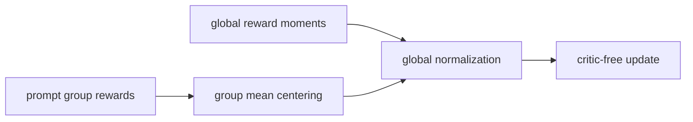
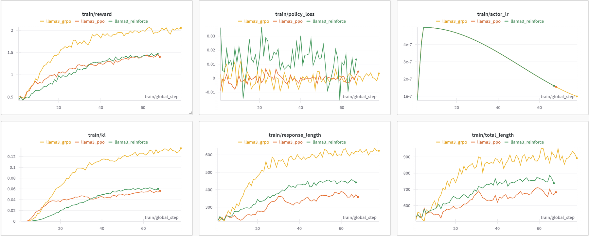

# REINFORCE++：全局优势归一化

> 本页在公开候选策略或确定性 Agent mini-suite 上复现可隔离的 RL 更新机制；不把轻量实验写成原论文规模模型或 benchmark 结论。

## 论文信息

| 字段 | 内容 |
|---|---|
| 论文链接 | [REINFORCE++：全局优势归一化（arXiv 2501.03262）](https://arxiv.org/abs/2501.03262) |
| 公司 / 机构 | 论文作者团队（机构详见原论文） |
| 首次公开日期 | 2025-01-04 |
| 原作者代码 | 未发现官方代码 |
| 本地 adapter / 算法键 | `reinforce-plus` |
| 本地复现代码 | [`src/auto_research/post_training/`](https://github.com/daiwk/auto-research/tree/main/src/auto_research/post_training/) |

## 原始论文总结

### 背景与主要改动

GRPO/RLOO 的 prompt-local 标准差会让不同难度组被随机方差重新加权。REINFORCE++ 保留组内中心化，但使用跨 batch 的全局优势尺度归一化，从而在不引入 critic 的前提下降低方差与局部偏置。



<!-- paper-figure:start -->
### 原论文关键图

[](https://ar5iv.labs.arxiv.org/html/2501.03262/assets/imgs/llama3.png)

> **原论文 Figure 1（关键图）**：展示原论文方法的总体设计和关键组成。图片来自[原论文](https://arxiv.org/abs/2501.03262)，版权归原作者所有；点击图片可查看来源。
<!-- paper-figure:end -->

### 核心公式

$$
\hat A_i=\frac{r_i-\overline r_{\rm group}}{\sqrt{\operatorname{EMA}_{\rm batch}[(r-\overline r)^2]}+\epsilon}.
$$

### 论文离线与线上效果

论文报告全局优势归一化在通用 RLHF、复杂推理和 agentic 设置中优于 prompt-local critic-free 基线与部分 PPO 对照；未报告线上 A/B。

## 本地复现

维护跨训练步的 reward 二阶矩，真实以它而非当前组 std 缩放 group-centered advantage。

```bash
auto-research post-train --algorithm reinforce-plus --dataset gsm8k-candidate --maximum-examples 256 --steps 120 --seed 42
```

固定 seed 汇总指标见 [`rl-papers-summary-seed42.json`](../../experiments/rl-papers-summary-seed42.json)。

## 复现边界

本地 EMA 是小批候选轨迹统计，不代表论文的大 batch 分布或人类偏好奖励。
