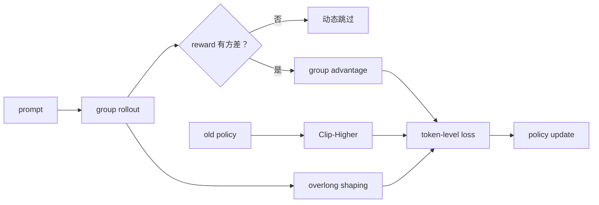
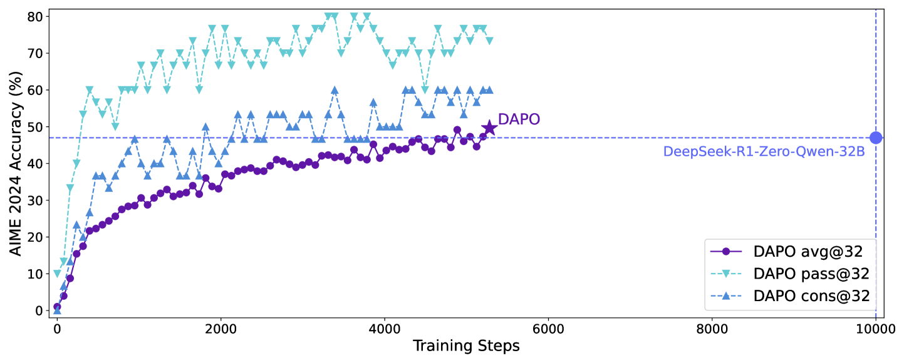

# DAPO：面向长推理的解耦 clipped policy optimization

> DAPO 在 GRPO 类在线训练上加入非对称裁剪、动态采样、token-level loss 与
> overlong reward shaping，解决熵坍缩和无效 batch。

## 论文信息

| 字段 | 内容 |
|---|---|
| 论文链接 | [DAPO: An Open-Source LLM Reinforcement Learning System at Scale](https://arxiv.org/abs/2503.14476) |
| 公司 / 机构 | ByteDance Seed / Tsinghua University AIR |
| 首次公开日期 | 2025-03-18 |
| 原作者代码 | [已开源：BytedTsinghua-SIA/DAPO](https://github.com/BytedTsinghua-SIA/DAPO) |
| 本地 adapter / CLI key | `dapo` |
| 本地复现代码 | `src/auto_research/post_training/` |

## 原始论文总结

### 背景与主要改动

长 CoT 的在线 RL 容易被标准对称 clip 限制探索，且全对/全错的组没有学习信号。
DAPO 用 Clip-Higher 放宽概率上升、Dynamic Sampling 丢弃零方差组、token-level loss
公平处理不同长度，并对过长回答分段惩罚。



<!-- paper-figure:start -->
### 原论文关键图

[](https://ar5iv.labs.arxiv.org/html/2503.14476/assets/x1.png)

> **原论文 Figure 1（关键图）**：展示原论文的训练流程与关键优化环节。图片来自[原论文](https://arxiv.org/abs/2503.14476)，版权归原作者所有；点击图片可查看来源。
<!-- paper-figure:end -->

### 核心公式

$$
\mathcal J_{\mathrm{DAPO}}=
\frac{1}{\sum_i|y_i|}\sum_{i,t}
\min\!\left(\rho_{i,t}\hat A_i,
\operatorname{clip}(\rho_{i,t},1-\epsilon_{\mathrm{low}},
1+\epsilon_{\mathrm{high}})\hat A_i\right),
$$

其中 $\epsilon_{\mathrm{high}}>\epsilon_{\mathrm{low}}$，并只保留
$\operatorname{std}(r_1,\ldots,r_G)>0$ 的动态采样组。

### 论文离线与线上效果

DAPO 用 Qwen2.5-32B 在 AIME 2024 达到 50 分，并报告以约一半训练步数超过此前
DeepSeek-R1-Zero-Qwen-32B 设置；没有生产线上 A/B 实验。

## 本地复现

| 指标 | 未训练策略 | DAPO |
|---|---:|---:|
| accuracy | 0.1641 | **0.7578** |
| mean reward | 0.3126 | **0.7996** |
| KL(reference) | 0.0000 | 1.0870 |

300 steps 刷新 old policy 18 次；最后一步 low/high clip 为 0.20/0.28，
clip fraction 0.25，平均伪 token 数 2.25，overlong penalty 0.0125。

```bash
auto-research post-train --algorithm dapo \
  --dataset gsm8k-candidate --maximum-examples 512 \
  --steps 300 --group-size 4 --seed 42 --offline
```

稳定指标：
[`classic-post-training-gsm8k-seed42.json`](../../experiments/classic-post-training-gsm8k-seed42.json)。

## 复现边界

实现四个核心训练机制和 old-policy rollout；候选长度由确定性伪 token 长度模拟，
没有复刻 32B 长 CoT、分布式训练、真实 token mask 或 AIME verifier。
