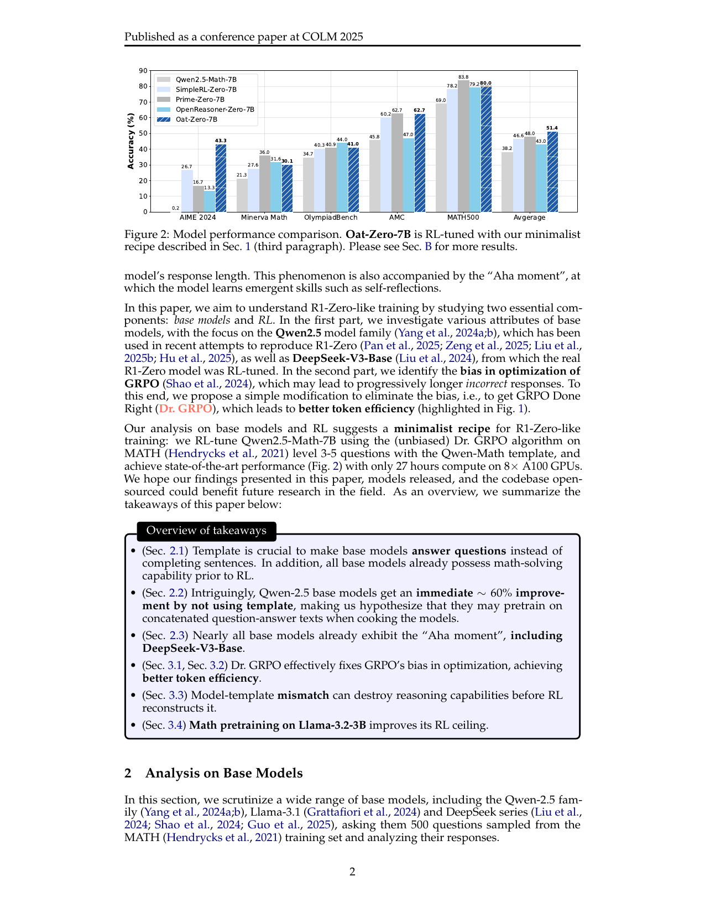

# Dr. GRPO：去长度与组方差偏置的组策略优化

> 本页在公开候选策略或确定性 Agent mini-suite 上复现可隔离的 RL 更新机制；不把轻量实验写成原论文规模模型或 benchmark 结论。

## 论文信息

| 字段 | 内容 |
|---|---|
| 论文链接 | [Dr. GRPO：去长度与组方差偏置的组策略优化（arXiv 2503.20783）](https://arxiv.org/abs/2503.20783) |
| 公司 / 机构 | SAIL 研究团队 |
| 首次公开日期 | 2025-03-26 |
| 原作者代码 | [已开源](https://github.com/sail-sg/understand-r1-zero) |
| 本地 adapter / 算法键 | `dr-grpo` |
| 本地复现代码 | [`src/auto_research/post_training/`](https://github.com/daiwk/auto-research/tree/main/src/auto_research/post_training/) |

## 原始论文总结

### 背景与主要改动

原始 GRPO 的 response 内长度平均和组内标准差会引入长度与题目难度偏置。Dr. GRPO 移除这两个归一化项，保留中心化的组相对奖励，让每条轨迹以原始尺度参与更新。


<!-- paper-figure:start -->
### 原论文关键图

[](https://arxiv.org/pdf/2503.20783#page=2)

> **原论文 Figure 2（性能比较）**：不同 R1-Zero 训练配置在多个数学基准上的准确率对比。图片来自[原论文](https://arxiv.org/abs/2503.20783)，版权归原作者所有；点击图片可查看来源。
<!-- paper-figure:end -->

### 核心公式

$$
\hat A_i=r_i-\frac1G\sum_{j=1}^G r_j,\qquad \mathcal L_{\rm DrGRPO}=-\frac1G\sum_i\min(r_i(\theta)\hat A_i,\operatorname{clip}(r_i(\theta))\hat A_i).
$$

### 论文离线与线上效果

论文报告在保持推理效果的同时提升 token efficiency，并以极简 R1-Zero recipe 在 7B base 上得到 AIME24 43.3%；未报告线上 A/B。

## 本地复现

在相同 GSM8K candidate-policy、步数和 seed 下真实移除组 std 与伪长度归一化，并与 GRPO 的更新统计对比。

```bash
auto-research post-train --algorithm dr-grpo --dataset gsm8k-candidate --maximum-examples 256 --steps 120 --seed 42
```

固定 seed 汇总指标见 [`rl-papers-summary-seed42.json`](../../experiments/rl-papers-summary-seed42.json)。

## 复现边界

候选策略没有自由生成 response 长度，伪长度只用于暴露归一化差异，不等同于论文的 token-level 长 CoT 训练。
