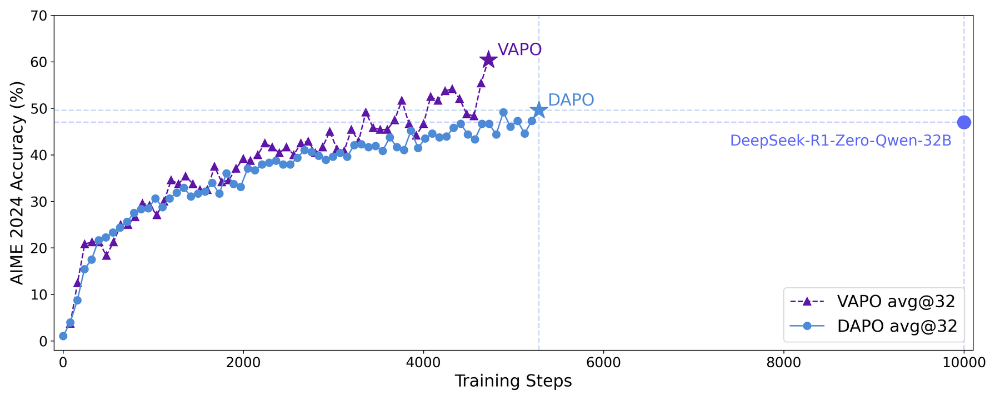

# VAPO：面向长 CoT 的 critic PPO

> 本页在公开候选策略或确定性 Agent mini-suite 上复现可隔离的 RL 更新机制；不把轻量实验写成原论文规模模型或 benchmark 结论。

## 论文信息

| 字段 | 内容 |
|---|---|
| 论文链接 | [VAPO：面向长 CoT 的 critic PPO（arXiv 2504.05118）](https://arxiv.org/abs/2504.05118) |
| 公司 / 机构 | 论文作者团队（机构详见原论文） |
| 首次公开日期 | 2025-04-07 |
| 原作者代码 | 未发现官方代码 |
| 本地 adapter / 算法键 | `vapo` |
| 本地复现代码 | [`src/auto_research/post_training/`](https://github.com/daiwk/auto-research/tree/main/src/auto_research/post_training/) |

## 原始论文总结

### 背景与主要改动

长 CoT 的 value-based PPO 易受 critic bias、异质 response 长度和稀疏奖励影响。VAPO 预训练 value model，并依 response 长度调节 actor 的 GAE/更新策略，以更稳定地进行 value-based 推理 RL。


<!-- paper-figure:start -->
### 原论文关键图

[](https://ar5iv.labs.arxiv.org/html/2504.05118/assets/fig/score.png)

> **原论文 Figure 1（关键图）**：展示原论文的训练流程与关键优化环节。图片来自[原论文](https://arxiv.org/abs/2504.05118)，版权归原作者所有；点击图片可查看来源。
<!-- paper-figure:end -->

### 核心公式

$$
\hat A_t^{\rm VAPO}=\sum_{l\ge0}(\gamma\lambda(L))^l\delta_{t+l},\qquad \mathcal L_{\rm actor}=\min(r_t\hat A_t,\operatorname{clip}(r_t)\hat A_t).
$$

### 论文离线与线上效果

论文在 Qwen-32B / AIME 2024 上报告 60.4，并称相同设置下超过 DeepSeek-R1-Zero-Qwen-32B 与 DAPO 十余分；未报告线上 A/B。

## 本地复现

复用可训练线性 critic，按候选伪长度调节 GAE 系数，并真实更新 actor、old policy 和 critic。

```bash
auto-research post-train --algorithm vapo --dataset gsm8k-candidate --maximum-examples 256 --steps 120 --seed 42
```

固定 seed 汇总指标见 [`rl-papers-summary-seed42.json`](../../experiments/rl-papers-summary-seed42.json)。

## 复现边界

本地 critic 不是预训练 value model，候选动作与伪长度替代自由生成长 CoT。
