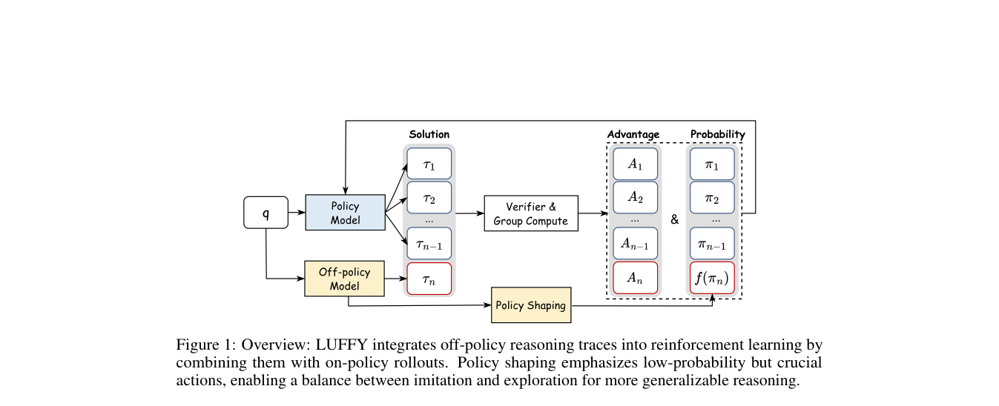

# LUFFY：离策略示范与 on-policy reasoning 的统一更新

> **保真度：核心机制复现**。本页不把确定性 mini-suite 冒充原论文完整 benchmark。

## 论文信息

| 字段 | 内容 |
|---|---|
| 论文链接 | [LUFFY：离策略示范与 on-policy reasoning 的统一更新（arXiv 2504.14945）](https://arxiv.org/abs/2504.14945) |
| 公司 / 机构 | University of Washington / SimpleReasoning |
| 首次公开日期 | 2025-04-21（arXiv v1） |
| 原作者代码 | [已开源](https://github.com/Simplified-Reasoning/LUFFY) |
| 本地 adapter / 方法键 | `luffy` |
| 本地复现代码 | [`src/auto_research/post_training/`](https://github.com/daiwk/auto-research/tree/main/src/auto_research/post_training/) |

## 原始论文总结

### 背景与主要改动

把离线高质量推理与在线 rollout 放进同一 support，通过正则化 importance ratio 保留 on-policy 行为。


<!-- paper-figure:start -->
### 原论文关键图

[](https://arxiv.org/pdf/2504.14945#page=3)

> **原论文 Figure 1（关键图）**：展示原论文方法的总体设计和关键组成。图片来自[原论文](https://arxiv.org/abs/2504.14945)，版权归原作者所有；点击图片可查看来源。
<!-- paper-figure:end -->

### 核心公式

$$
\rho=\pi_\theta(y|x)/\mu(y|x),\quad\mathcal L=-\mathbb E[\operatorname{clip}(\rho)A\log\pi_\theta]+\beta D_{KL}(\pi_\theta\Vert\pi_{ref}).
$$

### 论文离线与线上效果

论文在数学推理基准上超过纯 SFT、纯离策略和纯 on-policy 基线。 论文未报告生产线上 A/B，本页不补造线上数字。

## 本地复现

Arithmetic candidate suite、120 steps、256 examples、seed 42：accuracy 0.2344 → **0.5312（+126.67%）**；奖励、KL、长度和候选预算一致。

```bash
auto-research post-train --algorithm luffy --dataset arithmetic-smoke --maximum-examples 256 --steps 120 --seed 42
auto-research evolve --model post-training --dataset arithmetic-smoke --direction "组合 luffy 与已安装论文算子" --generations 2 --population 4
```

固定指标见 [`../../experiments/global-p0-20260808-seed42.json`](../../experiments/global-p0-20260808-seed42.json)。

## 复现边界

本地只验证论文特有目标、状态更新和公平预算；没有复刻原论文的大模型、多卡 RL、私有环境、真实网页或完整 benchmark，因而只报告机制验证，不声称数值复现原表。
