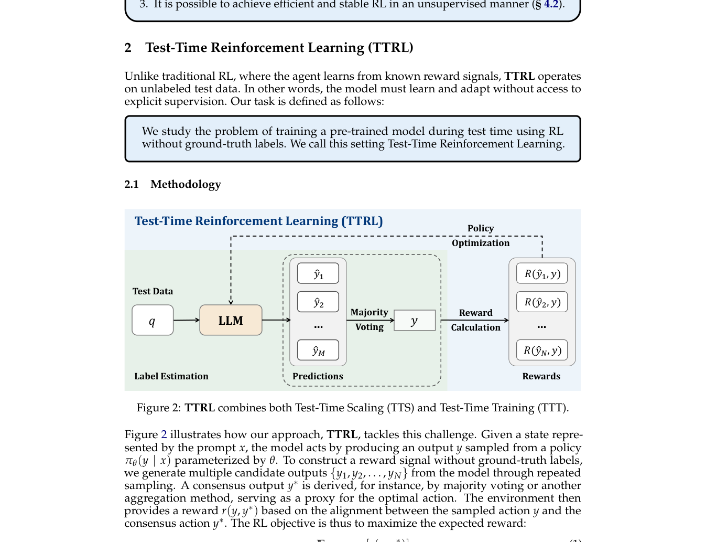

# TTRL：无标签测试集上的在线强化学习

> **保真度：核心机制复现**。本页不把确定性 mini-suite 冒充原论文完整 benchmark。

## 论文信息

| 字段 | 内容 |
|---|---|
| 论文链接 | [TTRL：无标签测试集上的在线强化学习（arXiv 2504.16084）](https://arxiv.org/abs/2504.16084) |
| 公司 / 机构 | PRIME-RL author team |
| 首次公开日期 | 2025-04-22（arXiv v1） |
| 原作者代码 | [已开源](https://github.com/PRIME-RL/TTRL) |
| 本地 adapter / 方法键 | `ttrl` |
| 本地复现代码 | [`src/auto_research/post_training/`](https://github.com/daiwk/auto-research/tree/main/src/auto_research/post_training/) |

## 原始论文总结

### 背景与主要改动

同一测试题多次采样，以多数一致答案作为伪标签并即时更新模型，不访问 gold label。


<!-- paper-figure:start -->
### 原论文关键图

[](https://arxiv.org/pdf/2504.16084#page=4)

> **原论文 Figure 2（关键图）**：展示原论文方法的总体设计和关键组成。图片来自[原论文](https://arxiv.org/abs/2504.16084)，版权归原作者所有；点击图片可查看来源。
<!-- paper-figure:end -->

### 核心公式

$$
\hat y=\operatorname{mode}\{y_k\}_{k=1}^K,\quad r_k=\mathbf1[y_k=\hat y],\quad\theta' = \theta+\eta\nabla J_{GRPO}(r).
$$

### 论文离线与线上效果

论文在多个 reasoning benchmark 与模型规模上报告 test-time 提升；无生产 A/B。 论文未报告生产线上 A/B，本页不补造线上数字。

## 本地复现

Arithmetic candidate suite、120 steps、256 examples、seed 42：accuracy 0.2344 → **0.2344（+0.00%）**；奖励、KL、长度和候选预算一致。

```bash
auto-research post-train --algorithm ttrl --dataset arithmetic-smoke --maximum-examples 256 --steps 120 --seed 42
auto-research evolve --model post-training --dataset arithmetic-smoke --direction "组合 ttrl 与已安装论文算子" --generations 2 --population 4
```

固定指标见 [`../../experiments/global-p0-20260808-seed42.json`](../../experiments/global-p0-20260808-seed42.json)。

## 复现边界

本地只验证论文特有目标、状态更新和公平预算；没有复刻原论文的大模型、多卡 RL、私有环境、真实网页或完整 benchmark，因而只报告机制验证，不声称数值复现原表。
