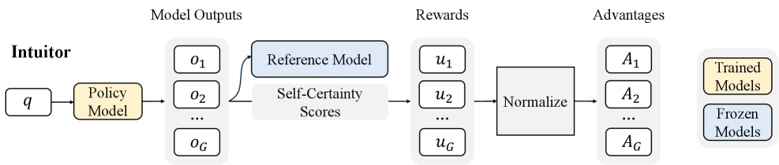

# INTUITOR：以自置信度替代外部 verifier

> **保真度：核心机制复现**。本页不把确定性 mini-suite 冒充原论文完整 benchmark。

## 论文信息

| 字段 | 内容 |
|---|---|
| 论文链接 | [INTUITOR：以自置信度替代外部 verifier（arXiv 2505.19590）](https://arxiv.org/abs/2505.19590) |
| 公司 / 机构 | University of California, Berkeley |
| 首次公开日期 | 2025-05-26（arXiv v1） |
| 原作者代码 | [已开源](https://github.com/sunblaze-ucb/Intuitor) |
| 本地 adapter / 方法键 | `intuitor` |
| 本地复现代码 | [`src/auto_research/post_training/`](https://github.com/daiwk/auto-research/tree/main/src/auto_research/post_training/) |

## 原始论文总结

### 背景与主要改动

把答案分布相对均匀分布的 KL 作为 intrinsic self-certainty reward，在没有答案和 verifier 时优化。


<!-- paper-figure:start -->
### 原论文关键图

[](https://arxiv.org/html/2505.19590v5/x2.png)

> **原论文 Figure 2（关键图）**：展示原论文的训练流程与关键优化环节。图片来自[原论文](https://arxiv.org/abs/2505.19590)，版权归原作者所有；点击图片可查看来源。
<!-- paper-figure:end -->

### 核心公式

$$
r_{int}(y)=D_{KL}(\pi_\theta(\cdot|x,y_{<t})\Vert U),\quad\max_\theta\mathbb E[r_{int}].
$$

### 论文离线与线上效果

论文在无外部奖励条件下提升多项推理任务；本地 mini-suite 不具测试分布漂移，因此可能不提升。 论文未报告生产线上 A/B，本页不补造线上数字。

## 本地复现

Arithmetic candidate suite、120 steps、256 examples、seed 42：accuracy 0.2344 → **0.2344（+0.00%）**；奖励、KL、长度和候选预算一致。

```bash
auto-research post-train --algorithm intuitor --dataset arithmetic-smoke --maximum-examples 256 --steps 120 --seed 42
auto-research evolve --model post-training --dataset arithmetic-smoke --direction "组合 intuitor 与已安装论文算子" --generations 2 --population 4
```

固定指标见 [`../../experiments/global-p0-20260808-seed42.json`](../../experiments/global-p0-20260808-seed42.json)。

## 复现边界

本地只验证论文特有目标、状态更新和公平预算；没有复刻原论文的大模型、多卡 RL、私有环境、真实网页或完整 benchmark，因而只报告机制验证，不声称数值复现原表。
