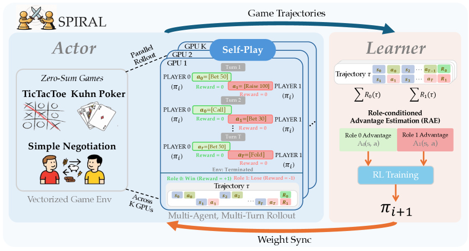

# SPIRAL：零和语言游戏驱动的自博弈推理

> **保真度：核心机制复现**。本页不把确定性 mini-suite 冒充原论文完整 benchmark。

## 论文信息

| 字段 | 内容 |
|---|---|
| 论文链接 | [SPIRAL：零和语言游戏驱动的自博弈推理（arXiv 2506.24119）](https://arxiv.org/abs/2506.24119) |
| 公司 / 机构 | Apple / academic collaborators |
| 首次公开日期 | 2025-06-30（arXiv v1） |
| 原作者代码 | [已开源](https://github.com/spiral-rl/spiral) |
| 本地 adapter / 方法键 | `spiral` |
| 本地复现代码 | [`src/auto_research/post_training/`](https://github.com/daiwk/auto-research/tree/main/src/auto_research/post_training/) |

## 原始论文总结

### 背景与主要改动

同一模型扮演出题者和解题者，在可自动判定的零和多轮语言游戏中形成逐步变难的课程。


<!-- paper-figure:start -->
### 原论文关键图

[](https://arxiv.org/html/2506.24119v3/x3.png)

> **原论文 Figure 3（关键图）**：展示原论文提出的核心架构、主要模块及其连接关系。图片来自[原论文](https://arxiv.org/abs/2506.24119)，版权归原作者所有；点击图片可查看来源。
<!-- paper-figure:end -->

### 核心公式

$$
\max_{\pi_A}\min_{\pi_B}\mathbb E_{\tau\sim(\pi_A,\pi_B)}[R(\tau)],\quad A_A=-A_B.
$$

### 论文离线与线上效果

论文显示仅依赖自博弈即可提升多项 reasoning benchmark，并在小模型上产生迁移。 论文未报告生产线上 A/B，本页不补造线上数字。

## 本地复现

Arithmetic candidate suite、120 steps、256 examples、seed 42：accuracy 0.2344 → **0.3438（+46.67%）**；奖励、KL、长度和候选预算一致。

```bash
auto-research post-train --algorithm spiral --dataset arithmetic-smoke --maximum-examples 256 --steps 120 --seed 42
auto-research evolve --model post-training --dataset arithmetic-smoke --direction "组合 spiral 与已安装论文算子" --generations 2 --population 4
```

固定指标见 [`../../experiments/global-p0-20260808-seed42.json`](../../experiments/global-p0-20260808-seed42.json)。

## 复现边界

本地只验证论文特有目标、状态更新和公平预算；没有复刻原论文的大模型、多卡 RL、私有环境、真实网页或完整 benchmark，因而只报告机制验证，不声称数值复现原表。
