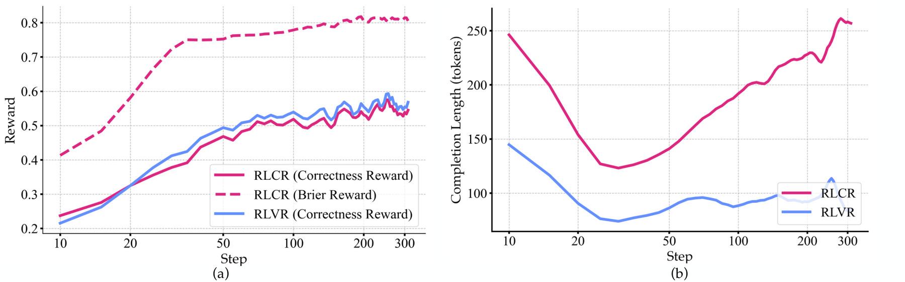

# RLCR：用 proper scoring rule 训练置信度

## 论文信息

| 字段 | 内容 |
|---|---|
| 论文链接 | [arXiv 2507.16806](https://arxiv.org/abs/2507.16806) |
| 公司/机构 | Massachusetts Institute of Technology（按第一作者署名单位） |
| 首次公开日期 | 2025-07-22（arXiv v1） |
| 原文开源代码 | 有：[damanimehul/RLCR](https://github.com/damanimehul/RLCR) |
| Adapter / 方法 | `system-one:rival-brier`、`system-one:rival-hybrid` |
| 本地复现代码 | `src/auto_research/system_one/local.py` |

## 原始论文总结

### 背景与主要改动

普通 binary reward 只奖励答对，容易鼓励模型无差别地自信。RLCR 让模型同时输出预测与置信度，并把 bounded proper scoring rule 加入奖励，使诚实概率具有最优激励。本地基线对完整候选分布最小化多类 Brier：

$$
\mathcal{L}_{Brier}=\sum_k(p_k-y_k)^2,
\qquad
\mathcal{L}_{hybrid}=\tfrac12(\mathcal{L}_{CE}+\mathcal{L}_{Brier}).
$$

这里复现的是 scoring-rule 机制，不是论文的 LLM rollout、RL 训练栈或 confidence-weighted scaling；因此以机制实验而非论文结果复刻报告。

<!-- paper-figure:start -->
### 原论文关键图

> **原论文 Figure 11（关键图）**：展示原论文的训练流程与关键优化环节。图片来自[原论文](https://arxiv.org/abs/2507.16806)，版权归原作者所有；点击图片可查看来源。
<!-- paper-figure:end -->

### 核心公式

本地多类 Brier 和 hybrid objective 如上，梯度对 softmax 概率完整反传，而不是把 confidence 当作事后显示字段。

### 论文离线与线上效果

论文报告 RLCR 在多个域内和域外任务上改善校准且不损失准确率。本地结果只用于相同 Banking77 协议内的目标函数比较。

## 复现边界

未运行论文的 LLM checkpoint 与 RL rollout，当前为 proper-scoring 机制实现。
