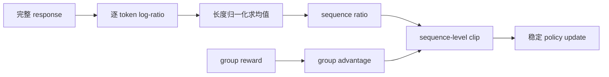

# GSPO：序列级重要性采样的稳定 RL

> GSPO 把 token-level importance ratio 改为 response 的序列级 ratio，使优化单元
> 与序列 reward 对齐，并降低长回答和 MoE 训练中的方差。

## 论文信息

| 字段 | 内容 |
|---|---|
| 论文链接 | [Group Sequence Policy Optimization](https://arxiv.org/abs/2507.18071) |
| 公司 / 机构 | Alibaba Qwen Team |
| 首次公开日期 | 2025-07-24 |
| 原作者代码 | 原论文未发布独立仓库；后续 [Alibaba ROLL 已提供 GSPO 实现](https://alibaba.github.io/ROLL/docs/User%20Guides/Algorithms/GSPO/) |
| 本地 adapter / CLI key | `gspo` |
| 本地复现代码 | `src/auto_research/post_training/` |

## 原始论文总结

### 背景与主要改动

GRPO/PPO 常逐 token 裁剪 ratio，但 reward 在完整序列级给出；长序列中单个异常 token
会造成大量裁剪，MoE routing 变化还会放大不稳定。GSPO 对每条 response 取平均
log-ratio，再指数化为单一 sequence ratio，整条序列共享 clip 权重。



### 核心公式

$$
s_i(\theta)=
\exp\!\left(\frac{1}{|y_i|}\sum_t
\log\frac{\pi_\theta(y_{i,t}|x,y_{i,<t})}
{\pi_{\theta_{\mathrm{old}}}(y_{i,t}|x,y_{i,<t})}\right),
$$

$$
\mathcal J_{\mathrm{GSPO}}=
\frac1G\sum_i\min\!\left(
s_i\hat A_i,\operatorname{clip}(s_i,1-\epsilon,1+\epsilon)\hat A_i
\right).
$$

### 论文离线与线上效果

论文报告 GSPO 在大规模 Qwen3 训练中比 token-level GRPO 更稳定，尤其改善长回答和
MoE 训练，并支撑后续模型训练；公开材料没有生产线上 A/B 实验。

## 本地复现

| 指标 | 未训练策略 | GSPO |
|---|---:|---:|
| accuracy | 0.1641 | **0.8281** |
| mean reward | 0.3126 | **0.8509** |
| KL(reference) | 0.0000 | 0.7017 |

300 steps 刷新 old policy 18 次；最后一组 sequence ratio 均值/标准差为
1.0131/0.0117。

```bash
auto-research post-train --algorithm gspo \
  --dataset gsm8k-candidate --maximum-examples 512 \
  --steps 300 --group-size 4 --seed 42 --offline
```

稳定指标：
[`classic-post-training-gsm8k-seed42.json`](../../experiments/classic-post-training-gsm8k-seed42.json)。

## 复现边界

实现了长度归一化 sequence ratio、group advantage、序列级 clip 与 reference KL；
本地候选没有真实 token trajectory，也未复刻 Qwen3 MoE 的 expert routing 与集群规模。
