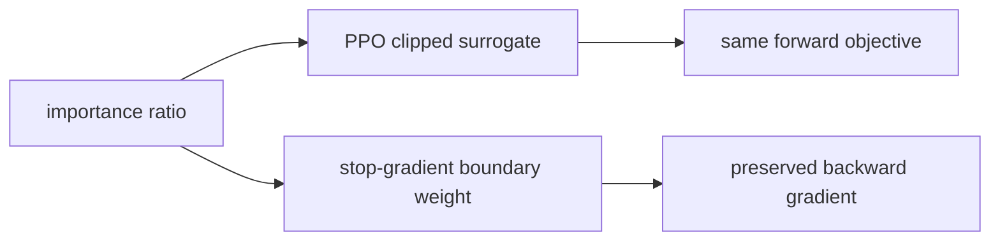
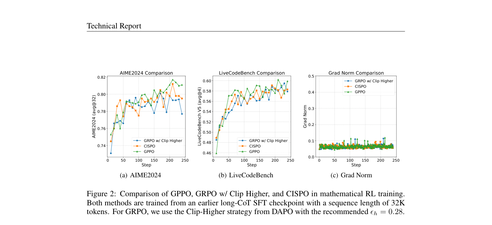

# GPPO：保留越界梯度的 PPO clip

> 本页在公开候选策略或确定性 Agent mini-suite 上复现可隔离的 RL 更新机制；不把轻量实验写成原论文规模模型或 benchmark 结论。

## 论文信息

| 字段 | 内容 |
|---|---|
| 论文链接 | [GPPO：保留越界梯度的 PPO clip（arXiv 2508.07629）](https://arxiv.org/abs/2508.07629) |
| 公司 / 机构 | Klear-Reasoner 作者团队（含 Alibaba Group） |
| 首次公开日期 | 2025-08-11 |
| 原作者代码 | 未发现独立算法开源仓库 |
| 本地 adapter / 算法键 | `gppo` |
| 本地复现代码 | [`src/auto_research/post_training/`](https://github.com/daiwk/auto-research/tree/main/src/auto_research/post_training/) |

## 原始论文总结

### 背景与主要改动

普通 PPO 在正优势高 ratio、负优势低 ratio 的越界象限直接令梯度为零，可能同时压制探索和从负样本学习。GPPO 保持 PPO 的前向 clipped objective，但通过 stop-gradient 边界权重恢复这些越界位置的反向信号。



<!-- paper-figure:start -->
### 原论文关键图

[](https://arxiv.org/pdf/2508.07629#page=11)

> **原论文 Figure 2（关键图）**：展示原论文的训练流程与关键优化环节。图片来自[原论文](https://arxiv.org/abs/2508.07629)，版权归原作者所有；点击图片可查看来源。
<!-- paper-figure:end -->

### 核心公式

$$
\tilde r_t=\operatorname{sg}(\operatorname{clip}(r_t,1-\epsilon,1+\epsilon)-r_t)+r_t,\quad \mathcal L=-\min(r_tA_t,\operatorname{clip}(r_t)A_t).
$$

### 论文离线与线上效果

Klear-Reasoner 报告 GPPO 改善探索与负样本利用，整体模型在 AIME 2024/2025 与 LiveCodeBench 上取得较强结果；未报告线上 A/B。

## 本地复现

在 GSM8K candidate-policy 中区分 PPO 正常和越界样本，前向仍计算 clipped surrogate，反向以 clip 边界权重保留越界梯度。

```bash
auto-research post-train --algorithm gppo --dataset gsm8k-candidate --maximum-examples 256 --steps 120 --seed 42
```

固定 seed 汇总指标见 [`rl-papers-summary-seed42.json`](../../experiments/rl-papers-summary-seed42.json)。

## 复现边界

本地不训练 Klear-Reasoner 或长 CoT SFT，只复现 GPPO 的前向/反向分离机制。
