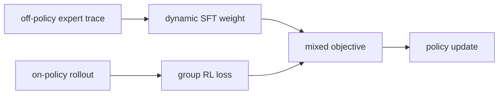
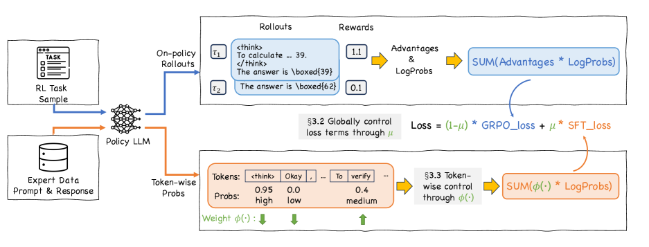

# CHORD：动态协调 SFT 与 on-policy RL

> 本页在公开候选策略或确定性 Agent mini-suite 上复现可隔离的 RL 更新机制；不把轻量实验写成原论文规模模型或 benchmark 结论。

## 论文信息

| 字段 | 内容 |
|---|---|
| 论文链接 | [CHORD：动态协调 SFT 与 on-policy RL（arXiv 2508.11408）](https://arxiv.org/abs/2508.11408) |
| 公司 / 机构 | Alibaba Group / ModelScope 作者团队 |
| 首次公开日期 | 2025-08-15 |
| 原作者代码 | [已开源](https://github.com/modelscope/Trinity-RFT/tree/main/examples/mix_chord) |
| 本地 adapter / 算法键 | `chord` |
| 本地复现代码 | [`src/auto_research/post_training/`](https://github.com/daiwk/auto-research/tree/main/src/auto_research/post_training/) |

## 原始论文总结

### 背景与主要改动

将 SFT 与 RL 串成两个独立阶段会造成 expert data 的过拟合或过早遗忘。CHORD 把专家 SFT 作为 on-policy RL 中动态退火的辅助目标，并以 token 级不确定性权重平滑从模仿过渡到探索。



<!-- paper-figure:start -->
### 原论文关键图

[](https://arxiv.org/html/2508.11408v3/x3.png)

> **原论文 Figure 3（关键图）**：展示原论文提出的核心架构、主要模块及其连接关系。图片来自[原论文](https://arxiv.org/abs/2508.11408)，版权归原作者所有；点击图片可查看来源。
<!-- paper-figure:end -->

### 核心公式

$$
\mathcal L=\lambda_t\mathcal L_{\rm SFT}+(1-\lambda_t)\mathcal L_{\rm RL},\qquad \lambda_t\downarrow\ \text{during training}.
$$

### 论文离线与线上效果

论文在多个实际任务上报告动态混合优于分离式 SFT+RL 与静态混合基线；未报告生产线上 A/B。

## 本地复现

把 verified gold candidate 作为 expert trace，真实按训练进度退火 SFT 项并与 on-policy group-RL 梯度相加。

```bash
auto-research post-train --algorithm chord --dataset gsm8k-candidate --maximum-examples 256 --steps 120 --seed 42
```

固定 seed 汇总指标见 [`rl-papers-summary-seed42.json`](../../experiments/rl-papers-summary-seed42.json)。

## 复现边界

本地不训练 LLM token-level uncertainty model，gold candidate 仅是确定性 expert 代理。
