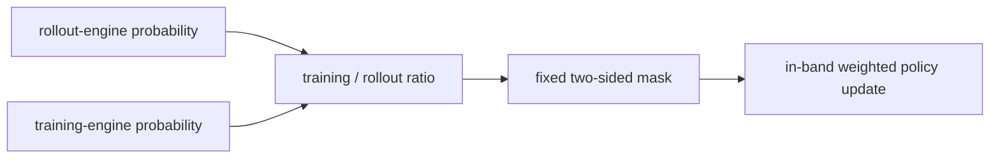
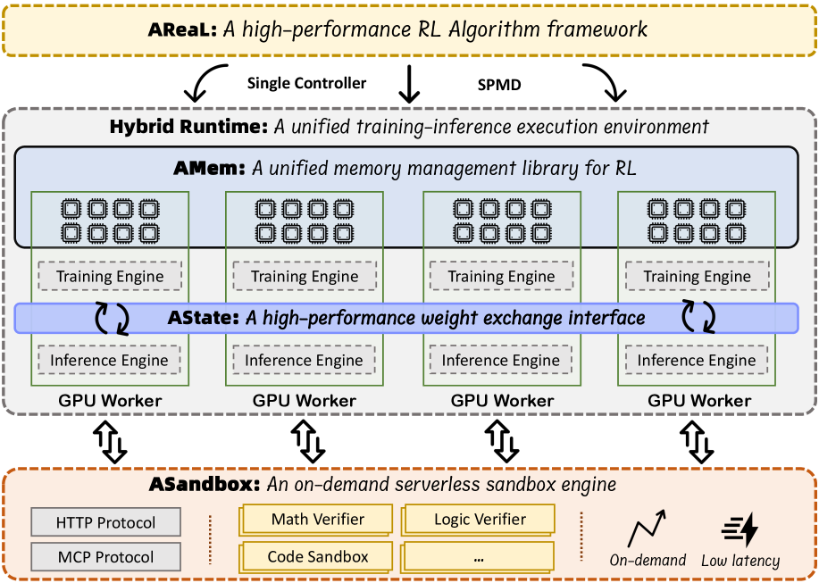

# IcePop：双侧训推失配掩码

> 本页在公开候选策略或确定性 Agent mini-suite 上复现可隔离的 RL 更新机制；不把轻量实验写成原论文规模模型或 benchmark 结论。

## 论文信息

| 字段 | 内容 |
|---|---|
| 论文链接 | [IcePop：双侧训推失配掩码（arXiv 2510.18855）](https://arxiv.org/abs/2510.18855) |
| 公司 / 机构 | Ant Group / Inclusion AI |
| 首次公开日期 | 2025-10-21 |
| 原作者代码 | 未发现/未发布 IcePop 独立算法源代码 |
| 本地 adapter / 算法键 | `icepop` |
| 本地复现代码 | [`src/auto_research/post_training/`](https://github.com/daiwk/auto-research/tree/main/src/auto_research/post_training/) |

## 原始论文总结

### 背景与主要改动

MoE router 会放大训练引擎与 rollout 引擎的微小数值差异，单侧 TIS 仍可能保留严重偏小的失配 ratio。IcePop 对训练侧与 rollout 引擎的 token 概率比设置固定双侧区间；区间内保留原始校正权重，区间外 token 的本次策略梯度直接归零。



<!-- paper-figure:start -->
### 原论文关键图

[](https://ar5iv.labs.arxiv.org/html/2510.18855/assets/x14.png)

> **原论文 Figure 9（关键图）**：展示原论文提出的核心架构、主要模块及其连接关系。图片来自[原论文](https://arxiv.org/abs/2510.18855)，版权归原作者所有；点击图片可查看来源。
<!-- paper-figure:end -->

### 核心公式

$$
\rho_t^{\rm TI}=\frac{\pi_{\rm train}(a_t\mid s_t)}{\pi_{\rm rollout}(a_t\mid s_t)},\qquad m_t=\mathbf1[c_{\rm low}\le\rho_t^{\rm TI}\le c_{\rm high}],\qquad \mathcal L=-\mathbb E[m_t\rho_t^{\rm TI}r_t^{\rm policy}A_t].
$$

### 论文离线与线上效果

Ring-1T 技术报告将 IcePop 与 C3PO++、ASystem 共同用于万亿参数 MoE RL，并报告 Ring-1T 在 AIME 2025 等推理基准上的结果；没有隔离 IcePop 的生产线上 A/B。

## 本地复现

在与 TIS 相同的候选策略和引擎失配模拟中采用公开实现常用的 `[0.5, 5.0]` 区间，区间外动作真正不产生梯度，同时保留旧 rollout policy 的 PPO ratio/clip。

```bash
auto-research post-train --algorithm icepop --dataset gsm8k-candidate --maximum-examples 256 --steps 120 --seed 42
```

固定 seed 汇总指标见 [`rl-papers-summary-seed42.json`](../../experiments/rl-papers-summary-seed42.json)。

## 复现边界

没有真实 MoE expert routing、万亿参数模型或异步集群；本地只隔离复现固定双侧 mask 与原始区间内校正权重。
