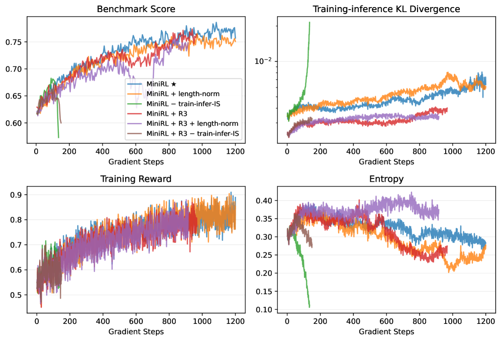

# Stabilizing Reinforcement Learning with LLMs

> **保真度：核心机制复现**。本页不把确定性 mini-suite 冒充原论文完整 benchmark。

## 论文信息

| 字段 | 内容 |
|---|---|
| 论文链接 | [Stabilizing Reinforcement Learning with LLMs（arXiv 2512.01374）](https://arxiv.org/abs/2512.01374) |
| 公司 / 机构 | Chujie Zheng（按一作归档） |
| 首次公开日期 | 2025-12-01（arXiv v1） |
| 原作者代码 | 否：未发现/未发布原作者官方代码仓库 |
| 本地 adapter / 方法键 | `minirl` |
| 本地复现代码 | [`src/auto_research/post_training/`](https://github.com/daiwk/auto-research/tree/main/src/auto_research/post_training/) |

## 原始论文总结

### 背景与主要改动

分解训推差异与 policy staleness，on-policy 使用 importance correction，off-policy 结合 clipping 与 MoE Routing Replay。


<!-- paper-figure:start -->
### 原论文关键图

[](https://ar5iv.labs.arxiv.org/html/2512.01374/assets/x1.png)

> **原论文 Figure 1（关键图）**：展示原论文的训练流程与关键优化环节。图片来自[原论文](https://arxiv.org/abs/2512.01374)，版权归原作者所有；点击图片可查看来源。
<!-- paper-figure:end -->

### 核心公式

$$
\rho_t=\pi_\theta/\pi_{rollout},\quad \mathcal L=-\mathbb E[\operatorname{clip}(\rho_t)A_t\log\pi_\theta],\quad z_t=z_t^{rollout}.
$$

### 论文离线与线上效果

30B MoE、数十万 GPU 小时实验显示稳定后不同 cold start 最终表现接近。 论文未报告生产线上 A/B，本页不补造线上数字。

## 本地复现

Arithmetic candidate suite、120 steps、seed 42：accuracy 0.2344 → **0.5000（+113.33%）**。

```bash
auto-research post-train --algorithm minirl --dataset arithmetic-smoke --maximum-examples 256 --steps 120 --seed 42
auto-research evolve --model post-training --dataset arithmetic-smoke --direction "组合 minirl 与已安装论文算子" --generations 2 --population 4
```

固定指标见 [`../../experiments/global-p1-20260808-seed42.json`](../../experiments/global-p1-20260808-seed42.json)。

## 复现边界

本地只验证论文特有目标、状态更新或评测协议；没有复刻原论文大模型、多卡训练、私有环境或完整公开 benchmark，因而只报告机制验证。
