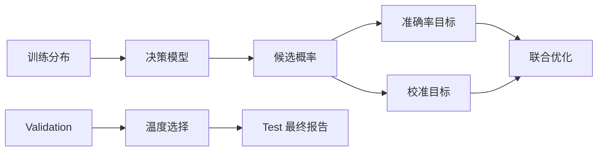
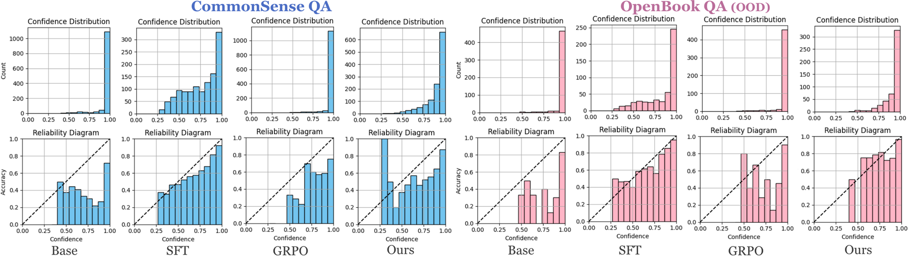

# Calibration-Aware RL：直接校准决策概率

## 论文信息

| 字段 | 内容 |
|---|---|
| 论文链接 | [arXiv 2601.13284](https://arxiv.org/abs/2601.13284) |
| 公司/机构 | University of Southern California / AWS AI Labs（按论文署名） |
| 首次公开日期 | 2026-01-19（arXiv v1） |
| 原文开源代码 | 否：截至 2026-09-20 未找到原作者公开实现仓库 |
| Adapter / 方法 | `system-one:rival-hybrid` |
| 本地复现代码 | `src/auto_research/system_one/` |

## 原始论文总结

### 背景与主要改动

论文指出 RLVR 虽能提高决策正确率，却可能让 decision token 极度过度自信；其方法直接调整决策 token 的概率，在保留准确率的同时降低 ECE。本仓库对应地把 accuracy 与 Brier/ECE 同时纳入报告，并只用 validation 拟合温度，禁止用 test 调参。

本地实现不复刻论文的完整 RLVR 流程，属于决策概率校准机制与评测协议实现。

<!-- paper-figure:start -->
### 原论文关键图

> **原论文 Figure 1（关键图）**：展示原论文方法的总体设计和关键组成。图片来自[原论文](https://arxiv.org/abs/2601.13284)，版权归原作者所有；点击图片可查看来源。
<!-- paper-figure:end -->

### 核心公式

本地以 validation NLL 选择温度 `T`，并用 Brier 与 ECE 检查 `softmax(z/T)` 的概率质量；test 不参与 `T` 的选择。

### 论文离线与线上效果

论文报告在维持 RLVR 准确率时最多降低约 9 个 ECE 点。本仓库不把该数字移植到本地小模型。

## 复现边界

未复现完整 RLVR 训练，只实现决策概率校准轴、数据隔离与统一报告。
