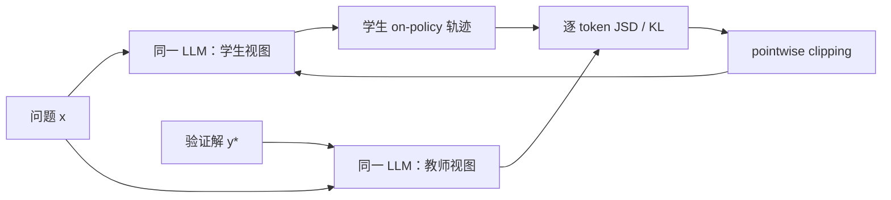
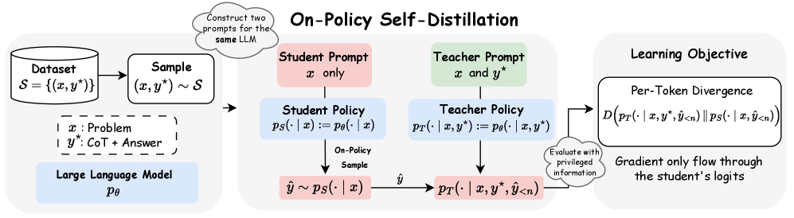

# OPSD：让模型用特权解题信息教会自身

> 保真度：实现同参数教师/学生双视图、学生 on-policy rollout、特权答案条件、
> 稠密分布监督与逐项散度裁剪；当前为候选策略机制复现，不是 Qwen3 参数级训练。

## 论文信息

| 字段 | 内容 |
|---|---|
| 论文链接 | [Self-Distilled Reasoner: On-Policy Self-Distillation for Large Language Models](https://arxiv.org/abs/2601.18734) |
| 公司 / 机构 | UCLA / HKU / Meta Superintelligence Labs |
| 首次公开日期 | 2026-01-26 |
| 原作者代码 | 是：[siyan-zhao/OPSD](https://github.com/siyan-zhao/OPSD) |
| 本地 adapter / 算法键 | `opsd` |
| 本地复现代码 | [`src/auto_research/post_training/`](https://github.com/daiwk/auto-research/tree/main/src/auto_research/post_training) |

## 原始论文总结

### 背景与主要改动

普通 OPD 仍需独立教师。OPSD 让同一个模型形成两个条件分布：学生只看问题，教师额外
看到验证过的解题过程或答案。轨迹由学生生成，教师只在学生实际到达的前缀上提供
全词表监督；逐 token pointwise divergence clipping 防止风格 token 主导训练。



<!-- paper-figure:start -->
### 原论文关键图

[](https://arxiv.org/html/2601.18734v3/x1.png)

> **原论文 Figure 1**：同一模型在普通与特权上下文下形成学生/教师视图，并在学生轨迹上蒸馏。
> 图片来自[原论文](https://arxiv.org/abs/2601.18734)，版权归原作者所有。
<!-- paper-figure:end -->

### 核心公式

$$
\mathcal L_{\mathrm{OPSD}}=
\mathbb E_{(x,y^*)}\mathbb E_{\hat y\sim p_S(\cdot|x)}
\frac1{|\hat y|}\sum_n
D\!\left(p_T(\cdot|x,y^*,\hat y_{<n})\Vert
p_S(\cdot|x,\hat y_{<n})\right).
$$

### 论文离线与线上效果

论文在 AIME24、AIME25、HMMT25 上报告 OPSD 优于 SFT 和 off-policy distillation，
并以约 4–8 倍于 GRPO 的 token efficiency 达到相近或更好效果；没有生产线上 A/B。

## 本地复现

```bash
auto-research post-train --algorithm opsd \
  --dataset gsm8k-candidate --maximum-examples 128 \
  --steps 120 --seed 42
```

| 指标 | 未训练策略 | OPSD |
|---|---:|---:|
| validation accuracy | 0.2500 | **0.9062** |
| mean reward | 0.3732 | **0.9009** |
| 学生 rollout / 稠密教师调用 | — | 480 / 480 |

稳定指标见
[`omitted-agentic-rl-opd-seed42.json`](../../experiments/omitted-agentic-rl-opd-seed42.json)。

## 复现边界

本地特权教师由当前策略与已验证候选答案共同构造，真实更新候选策略参数；未训练 Qwen3，
也未复跑竞赛数学数据。该结果只验证双视图数据流、散度与裁剪机制。
