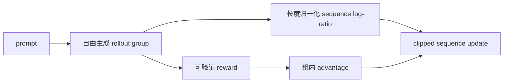
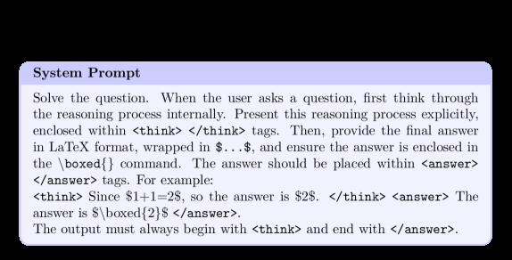

# LUSPO

> Length-Unbiased Sequence Policy Optimization：校正 sequence policy objective 的响应长度偏差。

## 论文信息

| 字段 | 内容 |
|---|---|
| 论文链接 | [Length-Unbiased Sequence Policy Optimization](https://arxiv.org/abs/2602.05261) |
| 公司 / 机构 | 作者团队 |
| 首次公开日期 | 2026-02-05 |
| 原作者代码 | 未发布 / 未发现独立官方仓库 |
| 本地 adapter / CLI key | `luspo` |
| 本地复现代码 | `src/auto_research/post_training/` |

## 原始论文总结

### 背景与主要改动

论文从目标函数分解解释不同 RLVR 算法为何产生不同的响应长度轨迹，并指出 GSPO 的
sequence ratio 仍含长度偏置。LUSPO 对 sequence log-probability 作长度无偏归一化，
避免训练中的长度坍塌。



<!-- paper-figure:start -->
### 原论文关键图

[](https://ar5iv.labs.arxiv.org/html/2602.05261/assets/x3.png)

> **原论文 Figure 3（关键图）**：展示原论文的训练流程与关键优化环节。图片来自[原论文](https://arxiv.org/abs/2602.05261)，版权归原作者所有；点击图片可查看来源。
<!-- paper-figure:end -->

### 核心公式

本地映射使用论文核心的长度归一化 sequence score：

$$
\bar\ell_\theta(y|x)=\frac{1}{|y|}\sum_{t=1}^{|y|}
\log\pi_\theta(y_t|x,y_{<t}),\qquad
\rho=\exp(\bar\ell_\theta-\bar\ell_{\rm ref}).
$$

### 论文离线与线上效果

论文在数学推理和多模态推理上报告 LUSPO 持续优于 GRPO、GSPO，并消除 response
length collapse；没有生产线上 A/B 实验。

## 本地复现

本地从 policy 自由采样完整响应，用 exact-answer verifier 评分，以长度归一化的
sequence ratio 和 group advantage 更新；同时记录 response length 与 reward 相关性。

```bash
auto-research post-train --algorithm luspo --dataset arithmetic-generate \
  --maximum-examples 48 --steps 6 --seeds 42,43,44 --offline
```

稳定指标：
[`free-generation-post-training-seeds42-44.json`](../../experiments/free-generation-post-training-seeds42-44.json)。

## 复现边界

已实现真实自由生成、sequence-level ratio 和长度无偏归一化；本地短算术响应无法覆盖
论文长 CoT 的长度动力学，结论仅用于代码路径与指标口径验证。
