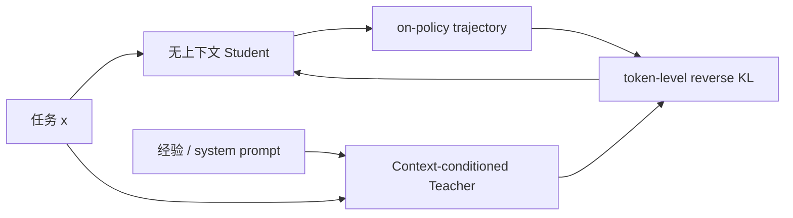
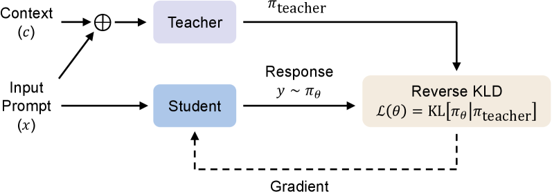

# OPCD：把上下文中的经验蒸馏进模型参数

> 保真度：实现无上下文学生 rollout、带经验上下文教师、reverse KL 与经验内化更新；
> 当前为候选策略机制复现，不等同于 Qwen3/VeRL 原始训练。

## 论文信息

| 字段 | 内容 |
|---|---|
| 论文链接 | [On-Policy Context Distillation for Language Models](https://arxiv.org/abs/2602.12275) |
| 公司 / 机构 | Microsoft Research |
| 首次公开日期 | 2026-02-12 |
| 原作者代码 | 是：[microsoft/LMOps/opcd](https://github.com/microsoft/LMOps/tree/main/opcd) |
| 本地 adapter / 算法键 | `opcd` |
| 本地复现代码 | [`src/auto_research/post_training/`](https://github.com/daiwk/auto-research/tree/main/src/auto_research/post_training) |

## 原始论文总结

### 背景与主要改动

提示词、检索文档和历史经验在上下文清空后会消失。OPCD 让无上下文学生生成轨迹，
再由带经验或系统提示的教师沿同一轨迹打分，以 reverse KL 把高概率行为内化到学生
参数中。论文覆盖经验知识蒸馏和系统提示蒸馏，并支持跨模型尺寸教师。



<!-- paper-figure:start -->
### 原论文关键图

[](https://arxiv.org/html/2602.12275v2/x2.png)

> **原论文 Figure 1**：从经验抽取到 on-policy consolidation 的完整流程。
> 图片来自[原论文](https://arxiv.org/abs/2602.12275)，版权归原作者所有。
<!-- paper-figure:end -->

### 核心公式

$$
\mathcal L_{\mathrm{OPCD}}=
\mathbb E_{y\sim\pi_\theta(\cdot|x)}
\sum_t D_{\mathrm{KL}}\!\left(
\pi_\theta(\cdot|x,y_{<t})
\Vert \pi_T(\cdot|x,c,y_{<t})\right).
$$

### 论文离线与线上效果

论文的 filtered experience 实验中，OPCD 将 Qwen3-8B 数学准确率从 base `75.0`
提升到 `80.9`；FrozenLake 从 `6.3` 提升到 `38.3`，并优于 off-policy context
distillation 的 `35.2`。论文没有生产线上 A/B。

## 本地复现

```bash
auto-research post-train --algorithm opcd \
  --dataset gsm8k-candidate --maximum-examples 128 \
  --steps 120 --seed 42
```

| 指标 | 未训练策略 | OPCD |
|---|---:|---:|
| validation accuracy | 0.2500 | **0.9688** |
| mean reward | 0.3732 | **0.9509** |
| 学生 rollout / context teacher 调用 | — | 480 / 480 |

稳定指标见
[`omitted-agentic-rl-opd-seed42.json`](../../experiments/omitted-agentic-rl-opd-seed42.json)。

## 复现边界

本地“经验上下文”是已验证答案形成的可审计条件分布，不包含真实长 system prompt；
未复跑 FrozenLake、Sokoban 或医疗/安全任务，因此不能将本地准确率与论文横向比较。
