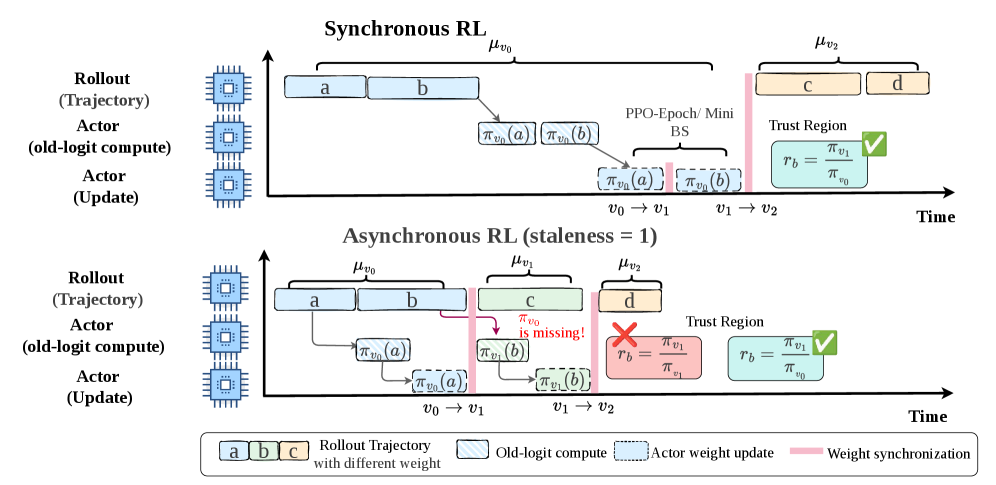

# Missing Old Logits in Asynchronous Agentic RL

> **保真度：核心机制复现**。本页不把确定性 mini-suite 冒充原论文完整 benchmark。

## 论文信息

| 字段 | 内容 |
|---|---|
| 论文链接 | [Missing Old Logits in Asynchronous Agentic RL（arXiv 2605.12070）](https://arxiv.org/abs/2605.12070) |
| 公司 / 机构 | Tianjin University / Tsinghua University / Peking University / JD AI Infra |
| 首次公开日期 | 2026-05-12（arXiv v1） |
| 原作者代码 | 否：未发现/未发布原作者官方代码仓库 |
| 本地 adapter / 方法键 | `missing-old-logits` |
| 本地复现代码 | [`src/auto_research/post_training/`](https://github.com/daiwk/auto-research/tree/main/src/auto_research/post_training/) |

## 原始论文总结

### 背景与主要改动

指出异步 RL 丢失历史训练侧 logits 后，训推校正与策略陈旧校正发生语义混叠；给出快照、old-logit model、中断同步和 PPO-EWMA 修复。


<!-- paper-figure:start -->
### 原论文关键图

[](https://arxiv.org/html/2605.12070v2/x1.png)

> **原论文 Figure 1（关键图）**：展示原论文的训练流程与关键优化环节。图片来自[原论文](https://arxiv.org/abs/2605.12070)，版权归原作者所有；点击图片可查看来源。
<!-- paper-figure:end -->

### 核心公式

$$
\rho=\underbrace{\pi_{train}^{old}/\pi_{infer}^{old}}_{train/infer}\underbrace{\pi_\theta/\pi_{train}^{old}}_{staleness}.
$$

### 论文离线与线上效果

论文报告 revised PPO-EWMA 同时提升训练速度和优化效果；无生产 A/B。 论文未报告生产线上 A/B，本页不补造线上数字。

## 本地复现

Arithmetic candidate suite、120 steps、seed 42：accuracy 0.2344 → **0.5000（+113.33%）**。

```bash
auto-research post-train --algorithm missing-old-logits --dataset arithmetic-smoke --maximum-examples 256 --steps 120 --seed 42
auto-research evolve --model post-training --dataset arithmetic-smoke --direction "组合 missing-old-logits 与已安装论文算子" --generations 2 --population 4
```

固定指标见 [`../../experiments/global-p1-20260808-seed42.json`](../../experiments/global-p1-20260808-seed42.json)。

## 复现边界

本地只验证论文特有目标、状态更新或评测协议；没有复刻原论文大模型、多卡训练、私有环境或完整公开 benchmark，因而只报告机制验证。
