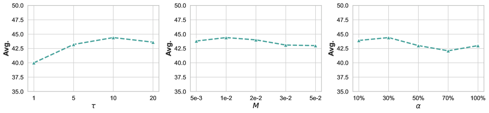

# ConSPO：对比式序列策略优化

> **保真度：核心机制复现**。本页不把确定性 mini-suite 冒充原论文完整 benchmark。

## 论文信息

| 字段 | 内容 |
|---|---|
| 论文链接 | [ConSPO：对比式序列策略优化（arXiv 2605.12969）](https://arxiv.org/abs/2605.12969) |
| 公司 / 机构 | Beijing Institute of Technology / Alibaba Qwen Business Unit / CUHK-Shenzhen / Zhongguancun Academy |
| 首次公开日期 | 2026-05-13（arXiv v1） |
| 原作者代码 | 未发现/未发布原作者官方代码 |
| 本地 adapter / 方法键 | `conspo` |
| 本地复现代码 | [`src/auto_research/post_training/`](https://github.com/daiwk/auto-research/tree/main/src/auto_research/post_training/) |

## 原始论文总结

### 背景与主要改动

将同组序列的优劣关系写成长度归一化 InfoNCE，避免 token 求和造成长度和组内尺度偏差。


<!-- paper-figure:start -->
### 原论文关键图

[](https://arxiv.org/html/2605.12969v3/x3.png)

> **原论文 Figure 3（关键图）**：展示原论文方法的总体设计和关键组成。图片来自[原论文](https://arxiv.org/abs/2605.12969)，版权归原作者所有；点击图片可查看来源。
<!-- paper-figure:end -->

### 核心公式

$$
s(y)=|y|^{-1}\sum_t\log\pi_\theta(y_t|y_{<t}),\quad\mathcal L=-\log\frac{e^{s(y^+)/\tau}}{\sum_{y\in G}e^{s(y)/\tau}}.
$$

### 论文离线与线上效果

论文在多项 RLVR reasoning benchmark 上报告稳定优于 group-policy baselines；无生产 A/B。 论文未报告生产线上 A/B，本页不补造线上数字。

## 本地复现

Arithmetic candidate suite、120 steps、256 examples、seed 42：accuracy 0.2344 → **0.6406（+173.33%）**；奖励、KL、长度和候选预算一致。

```bash
auto-research post-train --algorithm conspo --dataset arithmetic-smoke --maximum-examples 256 --steps 120 --seed 42
auto-research evolve --model post-training --dataset arithmetic-smoke --direction "组合 conspo 与已安装论文算子" --generations 2 --population 4
```

固定指标见 [`../../experiments/global-p0-20260808-seed42.json`](../../experiments/global-p0-20260808-seed42.json)。

## 复现边界

本地只验证论文特有目标、状态更新和公平预算；没有复刻原论文的大模型、多卡 RL、私有环境、真实网页或完整 benchmark，因而只报告机制验证，不声称数值复现原表。
