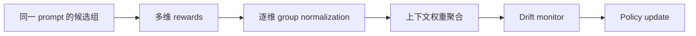
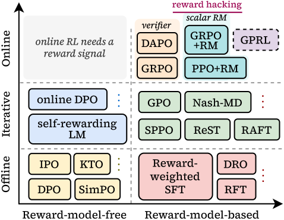

# GPRL：面向多维偏好的 Group-Relative RL

> 保真度：本地实现逐维 group normalization、动态聚合和漂移监控；候选式 GSM8K
> 主要验证算法状态，不覆盖论文的开放式多维 judge。

## 论文信息

| 字段 | 内容 |
|---|---|
| 论文链接 | [GPRL（arXiv 2605.18721）](https://arxiv.org/abs/2605.18721) |
| 公司 / 机构 | Stanford University / University of Oklahoma |
| 首次公开日期 | 2026-05-18 |
| 原作者代码 | 截至 2026-07-27 未在论文页发现公开仓库 |
| 本地 adapter / 算法键 | `gprl` |
| 本地复现代码 | [`src/auto_research/post_training/`](https://github.com/daiwk/auto-research/tree/main/src/auto_research/post_training) |

## 原始论文总结

### 背景与主要改动

单一标量 reward 容易掩盖 helpfulness、格式、推理和简洁度之间的冲突。GPRL 先在每个
偏好维度内部计算 group-relative advantage，再根据上下文聚合；漂移控制器检测某个
维度是否主导训练并调整权重。



<!-- paper-figure:start -->
### 原论文关键图

[](https://arxiv.org/html/2605.18721v3/x1.png)

> **原论文 Figure 1（关键图）**：展示原论文提出的核心架构、主要模块及其连接关系。图片来自[原论文](https://arxiv.org/abs/2605.18721)，版权归原作者所有；点击图片可查看来源。
<!-- paper-figure:end -->

### 核心公式

$$
\hat A_i^{(k)}=\frac{r_i^{(k)}-\mu_k}{\sigma_k+\epsilon},
\qquad
A_i=\sum_k\lambda_k(x)\hat A_i^{(k)}.
$$

逐维标准化避免量纲较大的 reward 直接吞没其他偏好，$\lambda_k(x)$ 则让权重随任务变化。

### 论文离线与线上效果

论文报告 Llama-3-8B-Instruct 在 AlpacaEval 2.0 的 length-controlled win rate 为
56.51%，并在 Arena-Hard、MT-Bench 和 WildBench 上优于 SimPO/SPPO。论文未报告生产
线上 A/B。

## 本地复现

本地 reward 轴为 outcome、format、reasoning、brevity；每轴独立标准化并记录漂移
事件。固定 GSM8K candidate 的 exact-answer 目标偏向 outcome，因此是对多目标方法
较不利但透明的压力测试。

```bash
auto-research post-train --algorithm gprl \
  --dataset gsm8k-candidate --maximum-examples 512 \
  --steps 300 --seed 42
```

| 指标 | 未训练策略 | GPRL |
|---|---:|---:|
| GSM8K candidate accuracy | 0.1641 | 0.3672 |
| mean reward | 0.3126 | 0.5002 |
| KL(reference) | 0.0000 | 1.1022 |
| drift events | — | 257 |

稳定指标见
[`post-training-gsm8k-candidate-seed42.json`](../../experiments/post-training-gsm8k-candidate-seed42.json)。

## 复现边界

当前没有接入 AlpacaEval judge、开放式生成或真实人类多维偏好。GPRL 低于 DPO/OPD 的
exact-answer accuracy 是已记录的负结果，不代表论文的多维开放式结论已被否定。
