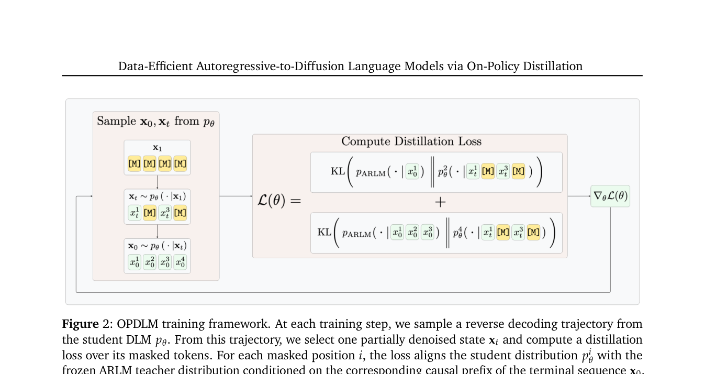

# OPDLM：从自回归模型高效迁移到扩散语言模型

> **Fidelity：核心机制复现**。本页把原论文结论、本地机制验证和未复刻部分分开陈述。

## 论文信息

| 字段 | 内容 |
|---|---|
| 论文链接 | [Data-Efficient Autoregressive-to-Diffusion Language Models via On-Policy Distillation（arXiv 2606.06712）](https://arxiv.org/abs/2606.06712) |
| 公司 / 机构 | Texas A&M University / Xingyu Su |
| 首次公开日期 | 2026-06-04（arXiv v1） |
| 原作者代码 | 未发现/未发布官方代码（核查日期：2026-08-08） |
| 本地 adapter / 方法键 | `opd-lm` |
| 本地复现代码 | [`src/auto_research/post_training/`](https://github.com/daiwk/auto-research/tree/main/src/auto_research/post_training/) |

## 原始论文总结

### 背景与主要改动

ARLM 改成双向注意力后既会遗忘原知识，也有随机 mask 训练与 confidence decoding 推理之间的偏移。OPDLM 让双向学生在自身推理轨迹上生成，冻结 AR 教师在同一轨迹给 target logits。


<!-- paper-figure:start -->
### 原论文关键图

[](https://arxiv.org/pdf/2606.06712#page=4)

> **原论文 Figure 2（关键图）**：展示原论文提出的核心架构、主要模块及其连接关系。图片来自[原论文](https://arxiv.org/abs/2606.06712)，版权归原作者所有；点击图片可查看来源。
<!-- paper-figure:end -->

### 核心公式

$$
y^{(k)}\sim\pi_{DLM}^{(k)},\quad \mathcal L_{OPD}=\mathbb E_{y^{(k)}}\sum_{t\in M_k}\operatorname{KL}(\pi_{AR}(\cdot|y_{<t})\Vert\pi_{DLM}(\cdot|y_{\setminus M_k})).
$$

### 论文离线与线上效果

达到强性能所需训练 token 比既有 DLM 转换方法少 15× 到 7,000×；无生产 A/B。

## 本地复现

用相邻候选状态模拟双向去噪视图，保留冻结 AR teacher anchor；不冒充完整 diffusion decoder。

Arithmetic candidate suite、120 steps、seed 42：accuracy 0.2344 → **0.6562（+180.00%）**。诊断字段完整记录在固定指标文件中。

```bash
auto-research post-train --algorithm opd-lm --dataset arithmetic-smoke --maximum-examples 256 --steps 120 --seed 42
auto-research evolve --model post-training --dataset arithmetic-smoke --direction "组合 opd-lm 与已安装论文算子" --generations 2 --population 4
```

固定指标见 [`../../experiments/p0-p1-closed-audit-20260808-seed42.json`](../../experiments/p0-p1-closed-audit-20260808-seed42.json)。

## 复现边界

本地使用确定性公共 mini-suite 验证核心状态更新和公平预算，不等同于原论文大模型、多卡 RL、私有环境或完整 benchmark；本地相对变化不得与原文提升混写。
