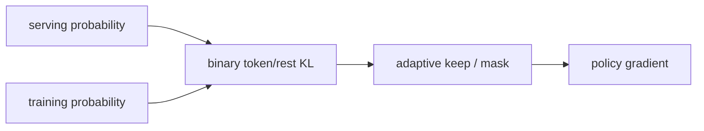
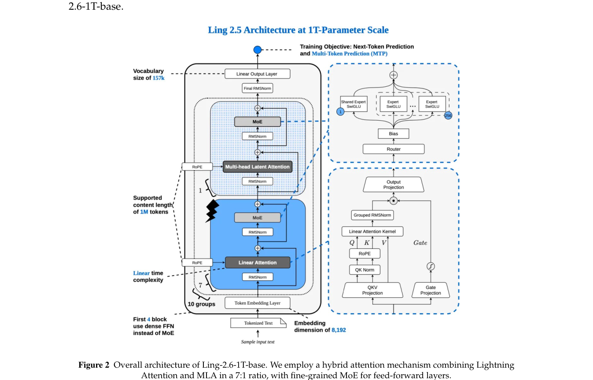

# KPop：二元 KL 自适应训推失配掩码

> 本页在公开候选策略或确定性 Agent mini-suite 上复现可隔离的 RL 更新机制；不把轻量实验写成原论文规模模型或 benchmark 结论。

## 论文信息

| 字段 | 内容 |
|---|---|
| 论文链接 | [KPop：二元 KL 自适应训推失配掩码（arXiv 2606.15079）](https://arxiv.org/abs/2606.15079) |
| 公司 / 机构 | Ling / Ring Team |
| 首次公开日期 | 2026-06-13 |
| 原作者代码 | 未发现独立算法开源仓库 |
| 本地 adapter / 算法键 | `kpop` |
| 本地复现代码 | [`src/auto_research/post_training/`](https://github.com/daiwk/auto-research/tree/main/src/auto_research/post_training/) |

## 原始论文总结

### 背景与主要改动

异步 rollout 中的 serving 概率与训练侧概率失配，固定 ratio mask 会误删正常探索或保留错误梯度。KPop 将当前 token 与“其余词表”压缩为二元分布，只有正反两个方向的 binary KL 都低于阈值时才保留该 token 的更新。



<!-- paper-figure:start -->
### 原论文关键图

[](https://arxiv.org/pdf/2606.15079#page=4)

> **原论文 Figure 2（关键图）**：展示原论文提出的核心架构、主要模块及其连接关系。图片来自[原论文](https://arxiv.org/abs/2606.15079)，版权归原作者所有；点击图片可查看来源。
<!-- paper-figure:end -->

### 核心公式

$$
D_{\rm bi}(p\Vert q)=p\log\frac pq+(1-p)\log\frac{1-p}{1-q},\quad m_t=\mathbf1[D_{\rm bi}(p\Vert q),D_{\rm bi}(q\Vert p)\le\tau].
$$

### 论文离线与线上效果

Ling/Ring 2.6 技术报告将 KPop 用于大规模异步 agentic RL，以稳定 coding、search、tool-use 和 workflow 环境训练；未给出生产线上 A/B。

## 本地复现

在候选策略的 rollout/训练双分布上计算双向 binary KL，并让 mask 真正决定每个采样动作是否产生 policy gradient。

```bash
auto-research post-train --algorithm kpop --dataset gsm8k-candidate --maximum-examples 256 --steps 120 --seed 42
```

固定 seed 汇总指标见 [`rl-papers-summary-seed42.json`](../../experiments/rl-papers-summary-seed42.json)。

## 复现边界

没有真实训推引擎、MoE routing 或万亿参数异步集群；本地只验证 binary-KL mask 的可审计更新语义。
