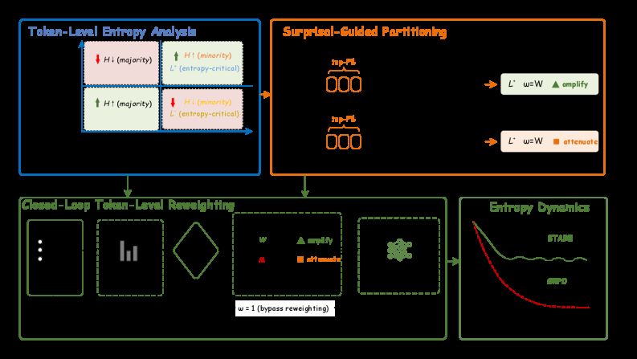

# STARE: Surprisal-Guided Token-Level Advantage Reweighting

> **保真度：核心机制复现**。本页不把确定性 mini-suite 冒充原论文完整 benchmark。

## 论文信息

| 字段 | 内容 |
|---|---|
| 论文链接 | [STARE: Surprisal-Guided Token-Level Advantage Reweighting（arXiv 2606.19236）](https://arxiv.org/abs/2606.19236) |
| 公司 / 机构 | Shenzhen International Graduate School, Tsinghua University / Tencent Hunyuan |
| 首次公开日期 | 2026-06-17（arXiv v1） |
| 原作者代码 | 是：[原作者仓库](https://github.com/hp-luo/STARE) |
| 本地 adapter / 方法键 | `stare` |
| 本地复现代码 | [`src/auto_research/post_training/`](https://github.com/daiwk/auto-research/tree/main/src/auto_research/post_training/) |

## 原始论文总结

### 背景与主要改动

按 batch surprisal 分位数识别 entropy-critical token，重加权其 advantage，并以目标 entropy 闭环 gate 调节方向。


<!-- paper-figure:start -->
### 原论文关键图

[](https://arxiv.org/html/2606.19236v1/x4.png)

> **原论文 Figure 2（关键图）**：展示原论文方法的总体设计和关键组成。图片来自[原论文](https://arxiv.org/abs/2606.19236)，版权归原作者所有；点击图片可查看来源。
<!-- paper-figure:end -->

### 核心公式

$$
\Delta H_t\approx A(\tau)\,g_\theta(x_t),\quad \tilde A_t=w(s_t,H-H^*)A(\tau).
$$

### 论文离线与线上效果

1.5B–32B、短/长 CoT 与多轮工具任务均维持 entropy；AIME24/25 平均 accuracy 超过 DAPO 4%–8%。 论文未报告生产线上 A/B，本页不补造线上数字。

## 本地复现

Arithmetic candidate suite、120 steps、seed 42：accuracy 0.2344 → **0.5312（+126.67%）**。

```bash
auto-research post-train --algorithm stare --dataset arithmetic-smoke --maximum-examples 256 --steps 120 --seed 42
auto-research evolve --model post-training --dataset arithmetic-smoke --direction "组合 stare 与已安装论文算子" --generations 2 --population 4
```

固定指标见 [`../../experiments/global-p1-20260808-seed42.json`](../../experiments/global-p1-20260808-seed42.json)。

## 复现边界

本地只验证论文特有目标、状态更新或评测协议；没有复刻原论文大模型、多卡训练、私有环境或完整公开 benchmark，因而只报告机制验证。
