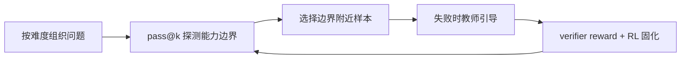
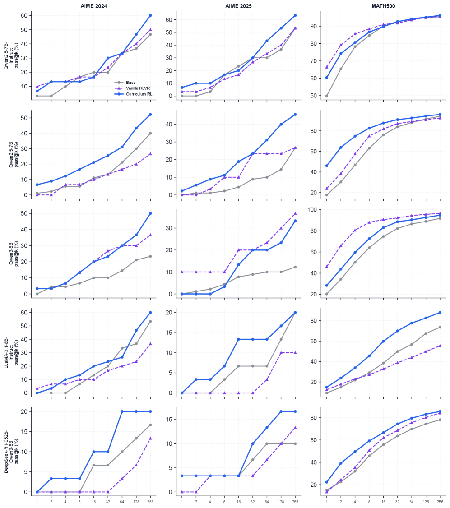

# Boundary-aware Curriculum RL（CoBA-RL）

> 定位当前能力边界，对边界附近样本提供教师引导，再用 RL 固化新增推理模式。

## 论文信息

| 字段 | 内容 |
|---|---|
| 论文链接 | [Curriculum Reinforcement Learning Can Incentivize Reasoning Capacity in LLMs Beyond the Base Model](https://arxiv.org/abs/2606.22317) |
| 公司 / 机构 | Zhejiang University / National University of Singapore |
| 首次公开日期 | 2026-06-21 |
| 原作者代码 | 未发布 / 未发现独立官方仓库 |
| 本地 adapter / CLI key | `coba-rl` |
| 本地复现代码 | `src/auto_research/post_training/` |

## 原始论文总结

### 背景与主要改动

普通 RLVR 可能只重新分配 base model 已有轨迹的概率，提升 pass@1 却不扩展高采样
pass@k 所反映的能力边界。该方法先用多次采样估计边界，在边界附近/之外注入教师
推理，再用 RL 巩固。



<!-- paper-figure:start -->
### 原论文关键图

[](https://arxiv.org/html/2606.22317v1/x1.png)

> **原论文 Figure 2（关键图）**：展示原论文方法的总体设计和关键组成。图片来自[原论文](https://arxiv.org/abs/2606.22317)，版权归原作者所有；点击图片可查看来源。
<!-- paper-figure:end -->

### 核心公式

$$
b_{t+1}=\operatorname{clip}\!\left(
\alpha b_t+(1-\alpha)(d(x)+\Delta(\widehat{\mathrm{pass}})),0,1
\right),
$$

本地以 $b_t$ 选择难度最接近的样本，并对自由生成序列执行 clipped policy update。

### 论文离线与线上效果

论文在 Qwen、Llama、DeepSeek base models 上同时提升 pass@1 与 pass@256；平均
pass@256 相对 base model 提升 9.8 个百分点、相对 Vanilla RLVR 提升 10.3 个百分点。
没有生产线上 A/B 实验。

## 本地复现

本地算术 suite 带可复现难度；训练器维护动态 curriculum boundary、采样边界样本，
无正确 rollout 时调用固定 revision 的真实 causal-LM teacher，并把教师 completion 以小权重
SFT 项注入 sequence RL。边界 pass@k 与教师 completion 分别缓存，缓存 fingerprint 不匹配会
直接拒绝；报告同时保存教师实际调用、缓存命中、输入/输出 tokens、估算成本及训练前后
pass@1/2/4/8 曲线。

```bash
auto-research post-train --algorithm coba-rl --dataset arithmetic-generate \
  --maximum-examples 48 --steps 6 --seeds 42,43,44 \
  --teacher-model-id Qwen/Qwen2.5-0.5B-Instruct \
  --teacher-revision 7ae557604adf67be50417f59c2c2f167def9a775 \
  --teacher-checkpoint-path checkpoints/qwen2.5-0.5b-instruct \
  --teacher-cache runs/coba/cache/teacher.json \
  --boundary-cache runs/coba/cache/boundary.json \
  --boundary-samples 8 --device cuda --offline
```

稳定指标：
[`free-generation-post-training-seeds42-44.json`](../../experiments/free-generation-post-training-seeds42-44.json)。

真实 A30 三 seed 工程验证共触发 3 次固定 Qwen2.5 教师调用，记录 169 个输入 token、94 个
输出 token，并生成训练前后 `pass@1/2/4` 能力边界曲线。一步 smoke 的平均 accuracy 仍为
0，因此这里只证明真实教师、双缓存与曲线链路可执行，不宣称效果提升。完整结果见
[真实教师三 seed 指标](metrics/a30-real-teacher-seeds42-44.json)。

## 复现边界

实现了边界状态、难度课程、真实教师触发、自由生成 RL、pass@k/教师缓存与成本曲线；
本地 teacher 只有 0.5B，且最高只统计 pass@8，没有运行论文规模 pass@256 或同规模学生，
因此不能宣称复现论文中的能力边界增量。
