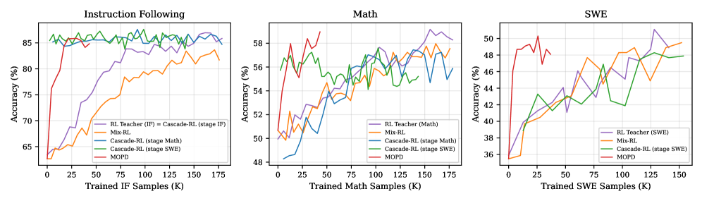

# MOPD：多领域教师的 on-policy 能力整合

> **Fidelity：核心机制复现**。本页把原论文结论、本地机制验证和未复刻部分分开陈述。

## 论文信息

| 字段 | 内容 |
|---|---|
| 论文链接 | [MOPD: Multi-Teacher On-Policy Distillation for Capability Integration in LLM Post-Training（arXiv 2606.30406）](https://arxiv.org/abs/2606.30406) |
| 公司 / 机构 | Xiaomi / Wenhan Ma |
| 首次公开日期 | 2026-06-29（arXiv v1） |
| 原作者代码 | 未发现/未发布官方代码（核查日期：2026-08-08） |
| 本地 adapter / 方法键 | `mopd` |
| 本地复现代码 | [`src/auto_research/post_training/`](https://github.com/daiwk/auto-research/tree/main/src/auto_research/post_training/) |

## 原始论文总结

### 背景与主要改动

多能力联合 RL 会产生域间耦合，参数合并和离策略微调又容易丢能力。MOPD 先独立训练各域 RL teacher，再只在 student 自己的 rollout 上组合教师密集信号，使各域可并行演进。


<!-- paper-figure:start -->
### 原论文关键图

[](https://arxiv.org/html/2606.30406v1/x1.png)

> **原论文 Figure 1（关键图）**：展示原论文的训练流程与关键优化环节。图片来自[原论文](https://arxiv.org/abs/2606.30406)，版权归原作者所有；点击图片可查看来源。
<!-- paper-figure:end -->

### 核心公式

$$
q(y_t|x)=\sum_d\alpha_d(x)\pi_{T_d}(y_t|x,y_{<t}),\quad \mathcal L=\mathbb E_{y\sim\pi_S}\sum_t\operatorname{CE}(q_t,\pi_S^t).
$$

### 论文离线与线上效果

Qwen3-30B-A3B 上超过 Mix-RL、Cascade RL、Off-Policy FT 与参数合并，并已用于 MiMo-V2-Flash 后训练；论文未给生产 A/B。

## 本地复现

实现四个奖励轴的 domain teacher、按样本域证据混合，并限制在 student rollout support。

Arithmetic candidate suite、120 steps、seed 42：accuracy 0.2344 → **0.3438（+46.67%）**。诊断字段完整记录在固定指标文件中。

```bash
auto-research post-train --algorithm mopd --dataset arithmetic-smoke --maximum-examples 256 --steps 120 --seed 42
auto-research evolve --model post-training --dataset arithmetic-smoke --direction "组合 mopd 与已安装论文算子" --generations 2 --population 4
```

固定指标见 [`../../experiments/p0-p1-closed-audit-20260808-seed42.json`](../../experiments/p0-p1-closed-audit-20260808-seed42.json)。

## 复现边界

本地使用确定性公共 mini-suite 验证核心状态更新和公平预算，不等同于原论文大模型、多卡 RL、私有环境或完整 benchmark；本地相对变化不得与原文提升混写。
