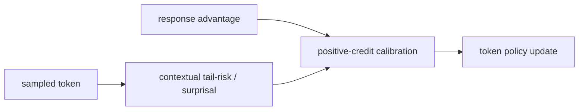
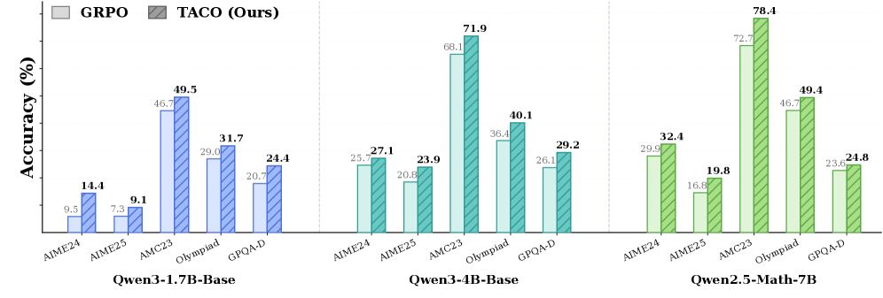

# TACO：尾部 token 信用校准

> 本页在公开候选策略或确定性 Agent mini-suite 上复现可隔离的 RL 更新机制；不把轻量实验写成原论文规模模型或 benchmark 结论。

## 论文信息

| 字段 | 内容 |
|---|---|
| 论文链接 | [TACO：尾部 token 信用校准（arXiv 2607.07976）](https://arxiv.org/abs/2607.07976) |
| 公司 / 机构 | Johns Hopkins University / Rice University / Workato / University of North Carolina at Charlotte |
| 首次公开日期 | 2026-07-08 |
| 原作者代码 | [已开源](https://github.com/xiuyilou/TACO) |
| 本地 adapter / 算法键 | `taco` |
| 本地复现代码 | [`src/auto_research/post_training/`](https://github.com/daiwk/auto-research/tree/main/src/auto_research/post_training/) |

## 原始论文总结

### 背景与主要改动

整条回答正确时，统一的正 advantage 会把内部不合理的低概率 token 一起强化，形成 positive-credit contamination。TACO 依据局部上下文计算 tail risk，并仅平滑降低高 risk token 的正信用，负信用仍完整保留。



<!-- paper-figure:start -->
### 原论文关键图

[](https://arxiv.org/html/2607.07976v1/x1.png)

> **原论文 Figure 1（关键图）**：展示原论文方法的总体设计和关键组成。图片来自[原论文](https://arxiv.org/abs/2607.07976)，版权归原作者所有；点击图片可查看来源。
<!-- paper-figure:end -->

### 核心公式

$$
\tilde A_t=\begin{cases}w(\operatorname{tailrisk}_t)A,&A>0\\A,&A\le0,\end{cases}\qquad 0<w(\cdot)\le1.
$$

### 论文离线与线上效果

论文在三种 LLM、八个 benchmark 上报告优于 GRPO 类基线，并改善长程 RL 稳定性；未报告线上 A/B。

## 本地复现

以 rollout 概率的 surprisal 代理 tail risk，正 advantage 的 tail 样本会被连续降权，负 advantage 不会被 mask。

```bash
auto-research post-train --algorithm taco --dataset gsm8k-candidate --maximum-examples 256 --steps 120 --seed 42
```

固定 seed 汇总指标见 [`rl-papers-summary-seed42.json`](../../experiments/rl-papers-summary-seed42.json)。

## 复现边界

候选动作而非逐 token CoT，无法复刻论文的上下文 tail-risk predictor，只验证信用校准方向。
