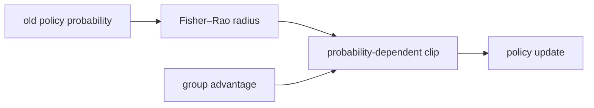
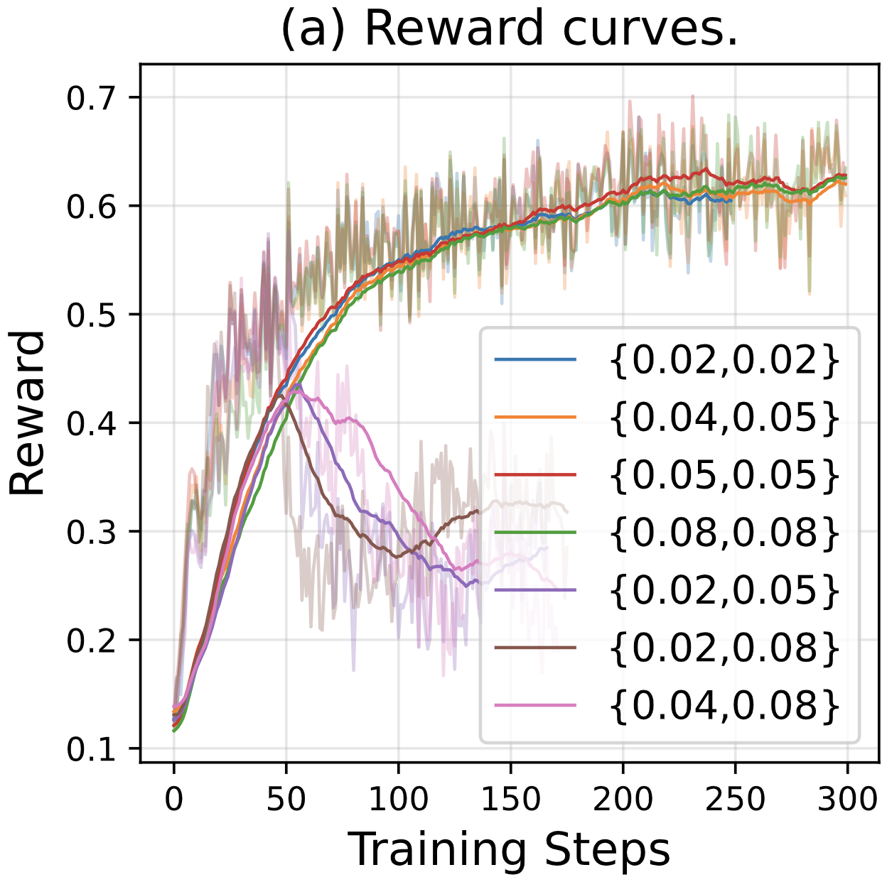

# RIPO：黎曼等距策略优化

> 本页在公开候选策略或确定性 Agent mini-suite 上复现可隔离的 RL 更新机制；不把轻量实验写成原论文规模模型或 benchmark 结论。

## 论文信息

| 字段 | 内容 |
|---|---|
| 论文链接 | [RIPO：黎曼等距策略优化（arXiv 2607.10169）](https://arxiv.org/abs/2607.10169) |
| 公司 / 机构 | 论文作者团队（机构详见原论文） |
| 首次公开日期 | 2026-07-11 |
| 原作者代码 | 未发现官方代码 |
| 本地 adapter / 算法键 | `ripo` |
| 本地复现代码 | [`src/auto_research/post_training/`](https://github.com/daiwk/auto-research/tree/main/src/auto_research/post_training/) |

## 原始论文总结

### 背景与主要改动

固定 PPO ratio 区间在低概率区域过于保守、在高概率区域又可能过大。RIPO 以 Fisher–Rao 几何定义策略距离，并按旧策略概率设置等距 clip 半径，使不同概率区域获得更均衡的局部 KL 预算。



<!-- paper-figure:start -->
### 原论文关键图

[](https://arxiv.org/html/2607.10169v1/figs/abs-re.png)

> **原论文 Figure 2（关键图）**：展示原论文的训练流程与关键优化环节。图片来自[原论文](https://arxiv.org/abs/2607.10169)，版权归原作者所有；点击图片可查看来源。
<!-- paper-figure:end -->

### 核心公式

$$
r_t=\frac{\pi_\theta(a_t\mid s_t)}{\pi_{\rm old}(a_t\mid s_t)},\quad \epsilon_t=\epsilon(p_{\rm old}(a_t\mid s_t)),\quad \operatorname{clip}(r_t,1-\epsilon_t,1+\epsilon_t).
$$

### 论文离线与线上效果

论文在七个竞赛级推理 benchmark 上报告优于既有 LLM RL 方法，AIME24 相对 GRPO 的最高增幅为 60%；未报告生产线上 A/B。

## 本地复现

在 GSM8K candidate-policy 上实际执行依旧概率相关的 Fisher–Rao clip、组内优势和旧 rollout policy 刷新，并记录各样本动态半径。

```bash
auto-research post-train --algorithm ripo --dataset gsm8k-candidate --maximum-examples 256 --steps 120 --seed 42
```

固定 seed 汇总指标见 [`rl-papers-summary-seed42.json`](../../experiments/rl-papers-summary-seed42.json)。

## 复现边界

候选动作概率替代 token 分布，验证动态 clip 与梯度路径，不复刻论文的全参数长 CoT 训练。
