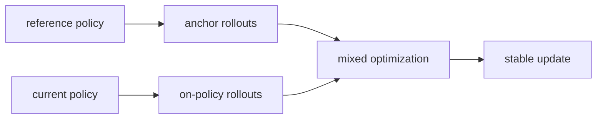
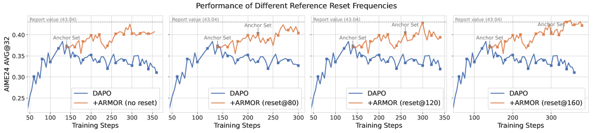

# ARMOR：reference anchor rollout

> 本页在公开候选策略或确定性 Agent mini-suite 上复现可隔离的 RL 更新机制；不把轻量实验写成原论文规模模型或 benchmark 结论。

## 论文信息

| 字段 | 内容 |
|---|---|
| 论文链接 | [ARMOR：reference anchor rollout（arXiv 2607.10481）](https://arxiv.org/abs/2607.10481) |
| 公司 / 机构 | 论文作者团队（机构详见原论文） |
| 首次公开日期 | 2026-07-11 |
| 原作者代码 | 未发现官方代码 |
| 本地 adapter / 算法键 | `armor` |
| 本地复现代码 | [`src/auto_research/post_training/`](https://github.com/daiwk/auto-research/tree/main/src/auto_research/post_training/) |

## 原始论文总结

### 背景与主要改动

单纯 reverse-KL 只能被动惩罚偏离，无法保证 reference 中已有有效解法仍被覆盖。ARMOR 从冻结 reference 主动采样 anchor trajectories，与当前策略 rollout 混合优化，用数据而不是辅助 KL 项稳定长程 RL。



<!-- paper-figure:start -->
### 原论文关键图

[](https://arxiv.org/html/2607.10481v2/x9.png)

> **原论文 Figure 4（关键图）**：展示原论文的训练流程与关键优化环节。图片来自[原论文](https://arxiv.org/abs/2607.10481)，版权归原作者所有；点击图片可查看来源。
<!-- paper-figure:end -->

### 核心公式

$$
\mathcal L=\mathbb E_{\tau\sim\pi_\theta}[\ell_{\rm on}(\tau)]+\lambda\mathbb E_{\tau\sim\pi_{\rm ref}}[\ell_{\rm anchor}(\tau)].
$$

### 论文离线与线上效果

论文在推理 benchmark 上报告 anchor rollout 能缓解验证集 collapse、支持更长训练；未报告生产线上 A/B。

## 本地复现

每个训练组一半从当前策略采样、一半从冻结 reference 采样，分别记录 anchor 数、权重和最终策略指标。

```bash
auto-research post-train --algorithm armor --dataset gsm8k-candidate --maximum-examples 256 --steps 120 --seed 42
```

固定 seed 汇总指标见 [`rl-papers-summary-seed42.json`](../../experiments/rl-papers-summary-seed42.json)。

## 复现边界

reference 是本地初始化候选策略，不包含论文规模的长程训练或真实轨迹池。
