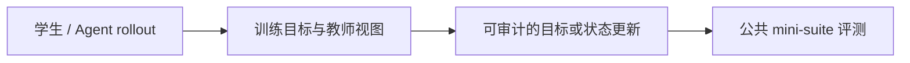
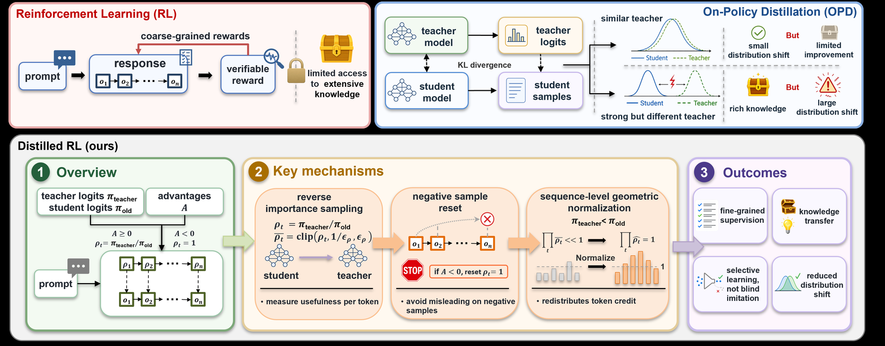

# Distilled RL：把教师监督变成细粒度 RL 信号

> **Fidelity：核心机制复现**。本页把原论文结论、本地机制验证和未复刻部分分开陈述。

## 论文信息

| 字段 | 内容 |
|---|---|
| 论文链接 | [Distilled Reinforcement Learning for LLM Post-training（arXiv 2607.17247）](https://arxiv.org/abs/2607.17247) |
| 公司 / 机构 | Chen Wang 等（按一作归档） |
| 首次公开日期 | 2026-07-19（arXiv v1） |
| 原作者代码 | [已开源：597358816/Distilled-RL](https://github.com/597358816/Distilled-RL) |
| 本地 adapter / 方法键 | `distilled-rl` |
| 本地复现代码 | [`src/auto_research/post_training/`](https://github.com/daiwk/auto-research/tree/main/src/auto_research/post_training/) |

## 原始论文总结

### 背景与主要改动

传统 RL 只有序列级奖励，OPD 又会无条件模仿教师。Distilled RL 把教师/学生反向概率比作为 token 级奖励重权重，只在正优势样本上启用教师，并以序列几何均值消除长度尺度偏差。



<!-- paper-figure:start -->
### 原论文关键图

[](https://arxiv.org/html/2607.17247v1/img/distilled-RL-main.png)

> **原论文 Figure 1（关键图）**：展示原论文方法的总体设计和关键组成。图片来自[原论文](https://arxiv.org/abs/2607.17247)，版权归原作者所有；点击图片可查看来源。
<!-- paper-figure:end -->

### 核心公式

$$
\rho_t=\pi_T(y_t|y_{<t})/\pi_{old}(y_t|y_{<t}),\quad \tilde\rho_t=\operatorname{clip}(\rho_t)/\exp(\frac1T\sum_s\log\operatorname{clip}(\rho_s)),\quad w_t=\mathbf1[A>0]\tilde\rho_t+\mathbf1[A\le0].
$$

### 论文离线与线上效果

三种学生模型的平均 Pass@1 均超过 RL、OPD 与 OPD+RL；例如 Qwen3-4B 为 58.96，RL 为 57.40。无生产 A/B。

## 本地复现

实现反向比率裁剪、负样本 reset 与序列几何归一化；教师不是无条件 KL target。

Arithmetic candidate suite、120 steps、seed 42：accuracy 0.2344 → **0.6094（+160.00%）**。诊断字段完整记录在固定指标文件中。

```bash
auto-research post-train --algorithm distilled-rl --dataset arithmetic-smoke --maximum-examples 256 --steps 120 --seed 42
auto-research evolve --model post-training --dataset arithmetic-smoke --direction "组合 distilled-rl 与已安装论文算子" --generations 2 --population 4
```

固定指标见 [`../../experiments/p0-p1-closed-audit-20260808-seed42.json`](../../experiments/p0-p1-closed-audit-20260808-seed42.json)。

## 复现边界

本地使用确定性公共 mini-suite 验证核心状态更新和公平预算，不等同于原论文大模型、多卡 RL、私有环境或完整 benchmark；本地相对变化不得与原文提升混写。
