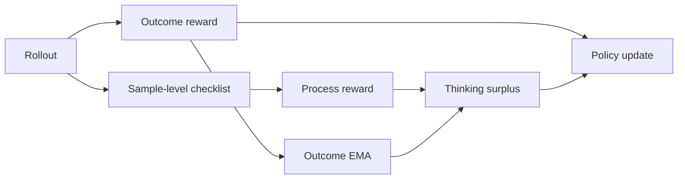
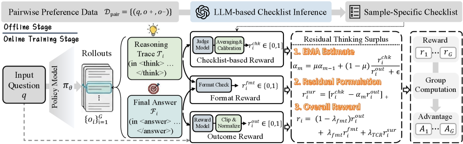

# TCR：Thinking Checklist Residual Reward

> 保真度：本地实现样本级 checklist、outcome EMA 和 thinking surplus；过程 verifier
> 是可控信号，不等同于论文的真实模型推理评审器。

## 论文信息

| 字段 | 内容 |
|---|---|
| 论文链接 | [TCR（arXiv 2607.19824）](https://arxiv.org/abs/2607.19824) |
| 公司 / 机构 | 论文未列机构 |
| 首次公开日期 | 2026-07-22 |
| 原作者代码 | 截至 2026-07-27 未发现公开仓库 |
| 本地 adapter / 算法键 | `tcr` |
| 本地复现代码 | [`src/auto_research/post_training/`](https://github.com/daiwk/auto-research/tree/main/src/auto_research/post_training) |

## 原始论文总结

### 背景与主要改动

只奖励最终答案会遗漏推理质量，直接叠加过程奖励又可能重复计算 outcome。TCR 为每个
样本构造 thinking checklist，并从过程得分中减去 outcome 的指数滑动基线，把更新集中
到“结果奖励尚未解释的思考增益”。



<!-- paper-figure:start -->
### 原论文关键图

[](https://arxiv.org/html/2607.19824v1/x3.png)

> **原论文 Figure 3（关键图）**：展示原论文的整体流程、关键阶段及其数据流向。图片来自[原论文](https://arxiv.org/abs/2607.19824)，版权归原作者所有；点击图片可查看来源。
<!-- paper-figure:end -->

### 核心公式

$$
r_{\mathrm{TCR}}=r_{\mathrm{outcome}}
+\alpha\left(r_{\mathrm{process}}
-\operatorname{EMA}(r_{\mathrm{outcome}})\right).
$$

残差项降低 outcome 与过程信号的重复贡献，并使过程奖励随训练状态自适应。

### 论文离线与线上效果

论文报告 TCR 在五个模型、三个模型家族上取得一致提升，但摘要没有给出可统一引用的
单一 headline 数值。论文仍处于研究评审阶段，未报告生产线上 A/B。

## 本地复现

本地 checklist verifier 为候选推理生成可控噪声过程得分；训练状态保存 outcome EMA
和 thinking surplus，并与其他方法使用完全相同的数据、步数和 seed。

```bash
auto-research post-train --algorithm tcr \
  --dataset gsm8k-candidate --maximum-examples 512 \
  --steps 300 --seed 42
```

| 指标 | 未训练策略 | TCR |
|---|---:|---:|
| GSM8K candidate accuracy | 0.1641 | **0.8359** |
| mean reward | 0.3126 | 0.8560 |
| KL(reference) | 0.0000 | 0.5629 |

稳定指标见
[`post-training-gsm8k-candidate-seed42.json`](../../experiments/post-training-gsm8k-candidate-seed42.json)。

## 复现边界

当前不包含真实自由生成、模型生成 checklist 或论文规模训练。结果只支持残差过程奖励
机制在候选策略上的有效性，不能作为对论文五模型实验的数值复刻。
