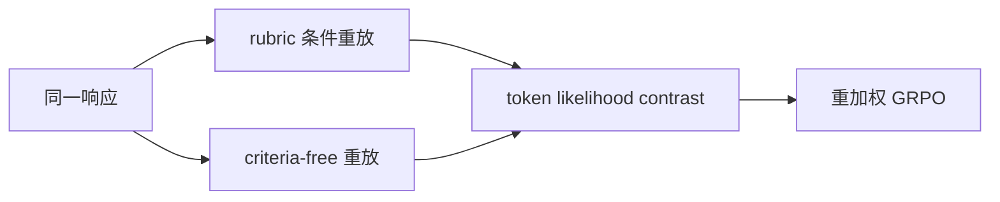
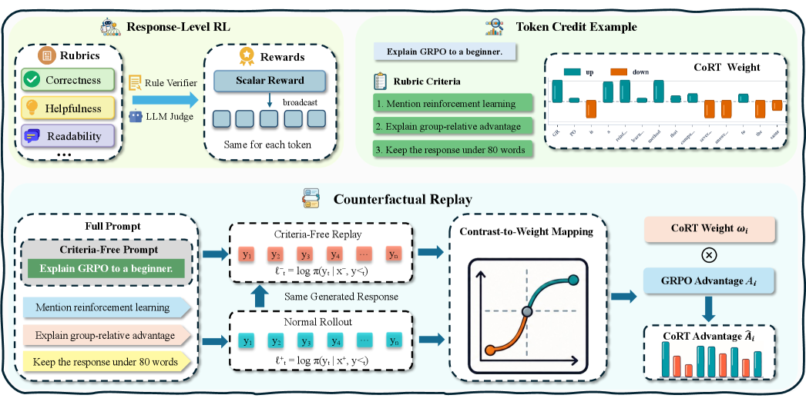

# CoRT：反事实重放的 Token 级 Rubric Credit

> 保真度：实现论文可隔离的核心状态与更新机制，并在统一公开数据或确定性
> mini-suite 上运行；不把轻量机制实验写成原规模大模型复现。

## 论文信息

| 字段 | 内容 |
|---|---|
| 论文链接 | [CoRT：反事实重放的 Token 级 Rubric Credit（arXiv 2607.25659）](https://arxiv.org/abs/2607.25659) |
| 公司 / 机构 | ByteDance internship / academic author team |
| 首次公开日期 | 2026-07-28 |
| 原作者代码 | 截至 2026-07-29 未发现官方公开仓库 |
| 本地 adapter / 算法键 | `cort` |
| 本地复现代码 | [`src/auto_research/post_training/`](https://github.com/daiwk/auto-research/tree/main/src/auto_research/post_training/) |

## 原始论文总结

### 背景与主要改动

对同一响应分别在带 rubric 和去 criteria 的上下文中重放，用 token 似然差重分配 GRPO 的响应级 advantage。



<!-- paper-figure:start -->
### 原论文关键图

[](https://arxiv.org/html/2607.25659v1/x2.png)

> **原论文 Figure 2（关键图）**：展示原论文方法的总体设计和关键组成。图片来自[原论文](https://arxiv.org/abs/2607.25659)，版权归原作者所有；点击图片可查看来源。
<!-- paper-figure:end -->

### 核心公式

$$
w_t=\operatorname{Norm}\!\left(\log\pi_\theta(y_t\mid x,r)-\log\pi_\theta(y_t\mid x)\right),\quad \mathcal L=-\sum_t w_tA\log\pi_\theta(y_t).
$$

### 论文离线与线上效果

跨模型和 reward 粒度的大多数配对实验优于 response-level GRPO，平均提升 4.4 个百分点，且不训练额外 token scorer。 论文没有报告生产线上 A/B，因此本站只保留离线/环境评测口径。

## 本地复现

在 GSM8K candidate-policy 上执行 rubric/criteria-free 两次反事实重放、归一化 token 权重和带符号 advantage 更新。

| 指标 | 未训练策略 | CoRT |
|---|---:|---:|
| accuracy | 0.1719 | **0.8906** |
| mean reward | 0.3124 | **0.8908** |
| KL(reference) | 0.0000 | 0.0201 |

```bash
auto-research post-train --algorithm cort --dataset gsm8k-candidate --maximum-examples 256 --steps 120 --seed 42
```

固定 seed 指标见
[`post-training-20260729-seed42.json`](../../experiments/post-training-20260729-seed42.json)。

## 复现边界

候选动作特征代理真实 token 序列；没有开放式生成、rubric judge 或大模型参数更新。
