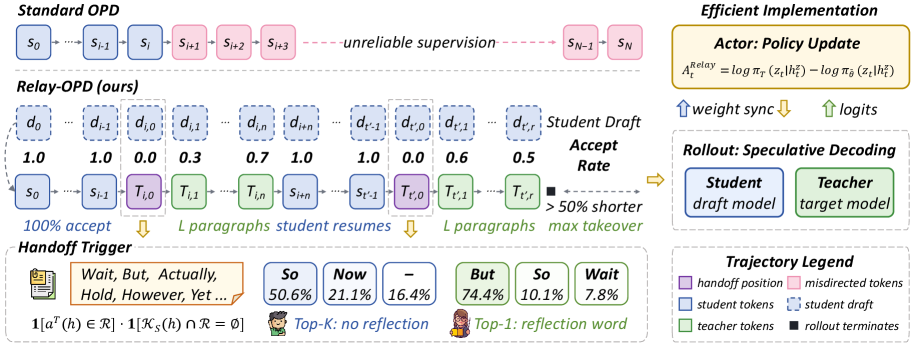

# Relay-OPD：轨迹接力式 On-Policy Distillation

> 保真度：实现论文可隔离的核心状态与更新机制，并在统一公开数据或确定性
> mini-suite 上运行；不把轻量机制实验写成原规模大模型复现。

## 论文信息

| 字段 | 内容 |
|---|---|
| 论文链接 | [Relay-OPD：轨迹接力式 On-Policy Distillation（arXiv 2607.26057）](https://arxiv.org/abs/2607.26057) |
| 公司 / 机构 | Zhejiang University / Alibaba Group Yuvion Team |
| 首次公开日期 | 2026-07-28 |
| 原作者代码 | [已开源](https://github.com/ZJU-REAL/Relay-OPD) |
| 本地 adapter / 算法键 | `relay-opd` |
| 本地复现代码 | [`src/auto_research/post_training/`](https://github.com/daiwk/auto-research/tree/main/src/auto_research/post_training/) |

## 原始论文总结

### 背景与主要改动

检测学生前缀失效后让教师短暂接管，再把轨迹交还学生；有限接力预算把监督集中到关键早期位置。


<!-- paper-figure:start -->
### 原论文关键图

[](https://arxiv.org/html/2607.26057v1/x4.png)

> **原论文 Figure 3（关键图）**：展示原论文方法的总体设计和关键组成。图片来自[原论文](https://arxiv.org/abs/2607.26057)，版权归原作者所有；点击图片可查看来源。
<!-- paper-figure:end -->

### 核心公式

$$
\mathcal L_{\mathrm{relay}}=-\sum_t\log p_\theta(y_t\mid y_{<t}),\quad \sum_j L_j\le B_{\mathrm{relay}}.
$$

### 论文离线与线上效果

Qwen3-1.7B 学生在八个数学推理 benchmark 上平均比标准 OPD 高 5.73%，比 FastOPD 高 1.49%，训练轨迹长度减少超过 50%。 论文没有报告生产线上 A/B，因此本站只保留离线/环境评测口径。

## 本地复现

GSM8K candidate-policy 上实现失效前缀检测、教师 handoff、有限 relay budget 和学生恢复生成；与同一未训练策略公平比较。

| 指标 | 未训练策略 | Relay-OPD |
|---|---:|---:|
| accuracy | 0.1719 | **0.8906** |
| mean reward | 0.3124 | **0.8867** |
| KL(reference) | 0.0000 | 0.5014 |

```bash
auto-research post-train --algorithm relay-opd --dataset gsm8k-candidate --maximum-examples 256 --steps 120 --seed 42
```

固定 seed 指标见
[`post-training-20260729-seed42.json`](../../experiments/post-training-20260729-seed42.json)。

## 复现边界

本地教师是可复现的候选分布缓存，并非 Qwen3-4B；因此验证接力状态机和监督方向，不冒充论文八卡训练。
