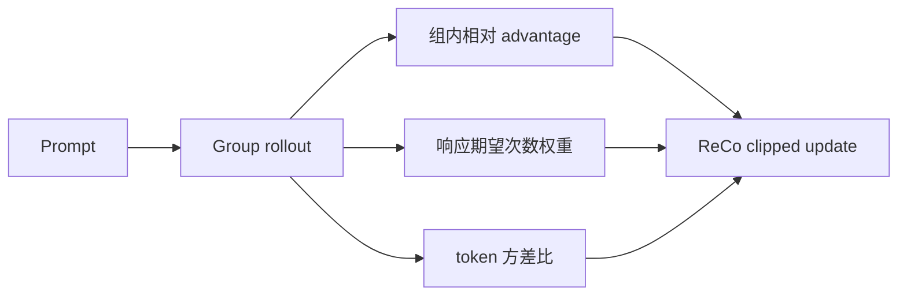
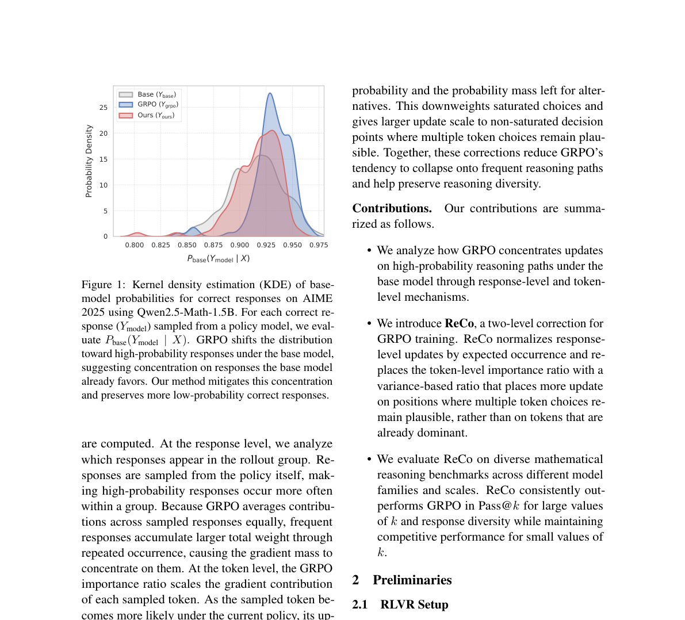

# ReCo

## 论文信息

| 字段 | 内容 |
|---|---|
| 论文链接 | [arXiv 2607.26862](https://arxiv.org/abs/2607.26862) |
| 公司 / 机构 | Seoul National University |
| 首次公开日期 | 2026-07-29（arXiv v1） |
| 原作者代码 | 未发布 / 未找到原作者公开仓库 |
| 本地 adapter / 方法 key | `reco-grpo` |
| 本地复现代码 | `src/auto_research/post_training/algorithms.py` |

## 原始论文总结

### 背景与主要改动

GRPO 容易重复采到高概率回答，并继续放大已经占优的 token，导致大 $k$ 下推理路径
覆盖率下降。ReCo 同时修正 response 和 token：按 rollout 组中的期望出现次数抑制
高频回答，再用 Bernoulli 方差比把更新集中到尚未饱和的决策点。



<!-- paper-figure:start -->
### 原论文关键图

[](https://arxiv.org/abs/2607.26862)

图片来自[原论文](https://arxiv.org/abs/2607.26862)，版权归原作者所有；点击图片可查看来源。
<!-- paper-figure:end -->

### 核心公式

$$
w_i^{\rm resp}=\frac{1}{G\bar\pi_{\theta_{\rm old}}(o_i|q)},\qquad
r_{i,t}^{\rm var}=
\frac{p^\theta_{i,t}(1-p^\theta_{i,t})}
{p^{\rm old}_{i,t}(1-p^{\rm old}_{i,t})},
$$

$$
g^{\rm ReCo}_{i,t}=w_i^{\rm resp}r_{i,t}^{\rm var}
\nabla_\theta\log\pi_\theta(o_{i,t}|h_{i,t})\hat A_i.
$$

### 论文离线与线上效果

Qwen2.5-Math-1.5B 的五项数学 benchmark 平均 Pass@64：GRPO 65.8，ReCo 68.9；
7B 为 69.0→72.6；Llama-3.1-8B-Instruct 为 46.2→57.5。该论文是后训练研究，
没有线上 A/B。

## 本地复现

candidate-policy mini-suite 中同时执行期望出现次数权重、方差比、PPO clip、KL 和
每 16 步 rollout-policy refresh。

```bash
auto-research post-train --algorithm reco-grpo --dataset gsm8k-candidate \
  --steps 120 --group-size 4 --maximum-examples 256 --seed 42
```

GSM8K candidate accuracy 0.1719→0.8750，mean reward 0.3124→0.8798；最后一次
更新的平均方差比 0.9842，rollout policy 刷新 7 次。完整指标见
[`latest-cross-domain-20260730-seed42.json`](../../experiments/latest-cross-domain-20260730-seed42.json)。

## 复现边界

这是 objective-level 机制复现，不是 Qwen/Llama 全参数 RLVR；本地候选动作代理完整
response，无法等价报告 Pass@64 或自然语言 Self-BLEU。
