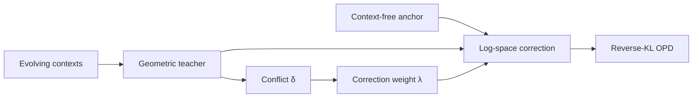

# Flux-OPD：演化上下文与冲突加权蒸馏

> 保真度：实现 context-free anchor、几何 teacher、contextual correction 与 conflict weighting。

## 论文信息

| 字段 | 内容 |
|---|---|
| 论文链接 | [Flux-OPD（arXiv 2607.28022）](https://arxiv.org/abs/2607.28022) |
| 公司 / 机构 | Peking University / Kling Team / Tsinghua University / Shanghai Jiao Tong University |
| 首次公开日期 | 2026-07-30 |
| 原作者代码 | 未发现/未发布官方实现（核查日期：2026-08-01） |
| 本地 adapter / 算法键 | `flux-opd` |
| 本地复现代码 | [`src/auto_research/post_training/`](https://github.com/daiwk/auto-research/tree/main/src/auto_research/post_training/) |

## 原始论文总结

### 背景与主要改动

固定上下文很快被学生吸收，直接更换上下文 teacher 又会让目标跳变。Flux-OPD 固定 context-free teacher 为锚，只注入多个演化上下文 teacher 相对锚点的 log-probability 差，并用几何均值归一化常数表示冲突、冲突越大修正越弱。



<!-- paper-figure:start -->
### 原论文关键图

[](https://arxiv.org/html/2607.28022v1/x1.png)

图片来自[原论文](https://arxiv.org/abs/2607.28022)，版权归原作者所有；点击图片可查看来源。
<!-- paper-figure:end -->

### 核心公式

$$
q_k^{\mathrm{flux}}=\operatorname{softmax}(\log q_0+\lambda_k(\log q_{\mathrm{geo},k}-\log q_0)),\quad \delta_k=-\log Z_k.
$$

### 论文离线与线上效果

视频 prompt optimization 的 student 平均 VBench 80.18，高于 OPD 79.28；Video-Bench 平均 3.61，高于 OPD 3.54。HealthBench 同样优于所列 OPD 范式；无生产 A/B。

## 本地复现

> **本地对照口径**：同一 GSM8K candidate-policy、120 steps、seed 42；accuracy 从 0.1719 到 **0.8438（+390.91%）**。

```bash
auto-research post-train --algorithm flux-opd --dataset gsm8k-candidate --maximum-examples 256 --steps 120 --seed 42
```

固定指标见 [`beta-flux-opd-gsm8k-seed42.json`](../../experiments/beta-flux-opd-gsm8k-seed42.json)。

## 复现边界

本地两个 reward axis 代理演化上下文 teacher；未调用视频模型、医疗 teacher 或大模型上下文抽取。
