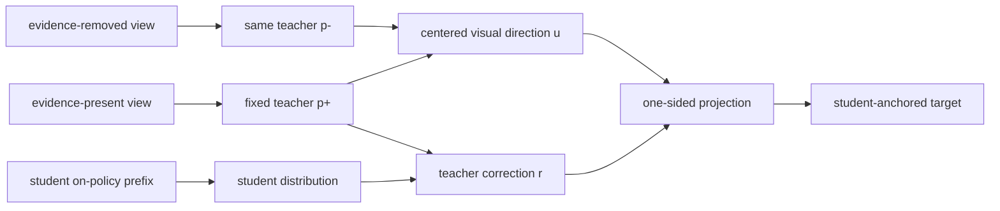
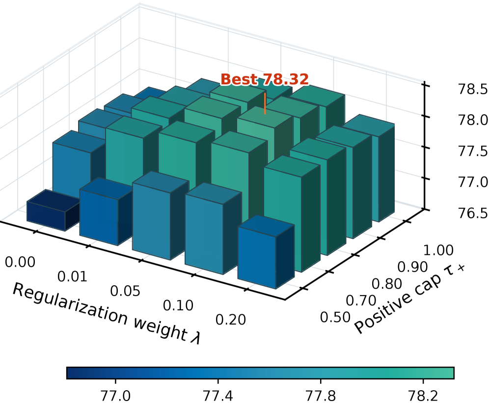

# VAD：视觉证据归因的多模态 On-Policy Distillation

> 本页复现论文可隔离的 counterfactual target reconstruction；本地候选策略用过程证据轴模拟 evidence-present / evidence-removed 教师视图，不把它写成 4B/9B 多模态模型复现。

## 论文信息

| 字段 | 内容 |
|---|---|
| 论文链接 | [VAD（arXiv 2607.28590）](https://arxiv.org/abs/2607.28590) |
| 公司 / 机构 | Shanghai Jiao Tong University / Xiaohongshu / CUHK / Zhejiang University / Southeast University |
| 首次公开日期 | 2026-07-30 |
| 原作者代码 | [已开源](https://github.com/DeepExperience/VAD_Multimodal_OPD)；[模型权重](https://huggingface.co/zhangkangning/VAD_for_Qwen3.5-4b) |
| 本地 adapter / 算法键 | `vad` |
| 本地复现代码 | [`src/auto_research/post_training/`](https://github.com/daiwk/auto-research/tree/main/src/auto_research/post_training/) |

## 原始论文总结

### 背景与主要改动

多模态 OPD 直接匹配 privileged-view teacher 时，教师修正同时混入视觉证据、语言先验和教师自身偏差。VAD 对同一冻结教师分别输入“相关视觉证据存在/移除”两种视图，以 centered log-probability 差构造带符号的视觉方向，再把原教师修正单侧投影到该方向，重建以学生当前分布为锚的 target；完整 privileged teacher 只保留为弱正则。



<!-- paper-figure:start -->
### 原论文关键图

[](https://arxiv.org/html/2607.28590v1/x3.png)

> **原论文 Figure 5（关键图）**：展示原论文的整体流程、关键阶段及其数据流向。图片来自[原论文](https://arxiv.org/abs/2607.28590)，版权归原作者所有；点击图片可查看来源。
<!-- paper-figure:end -->

### 核心公式

$$
r_t=\phi_t(p_T^+)-\phi_t(p_S^0),\quad u_t=\phi_t(p_T^+)-\phi_t(p_T^-),\quad
\beta_t=\frac{[\langle r_t,u_t\rangle]_+}{\lVert u_t\rVert_2^2+\zeta},
$$

$$
q_{T,t}=\operatorname{softmax}\!\left(\phi_t(p_S^0)+\operatorname{clip}(\beta_tu_t,-c,c)\right).
$$

### 论文离线与线上效果

在 Qwen3.5-4B 的六个视觉 benchmark 上，Full VAD 平均 78.32，优于直接 privileged-teacher matching 的 75.92；9B 规模也优于 Vision-OPD 与 visual-advantage weighting。论文未报告生产线上 A/B。

## 本地复现

本地实现同一冻结教师的两次前向、centered log-prob 差、单侧投影、支持/反驳分支预算、student-anchored target、对称 JSD 和 0.1 权重的弱教师正则；保存 projection、evidence norm、分支预算和 teacher-correction alignment。GSM8K candidate seed 42 的 accuracy 从 0.1719 升至 0.7969（相对训练前 +363.64%），mean reward 从 0.3124 升至 0.8153，KL(reference) 为 0.0092；120 次更新中单侧投影激活率 100%，平均 alignment 0.5145。该数值只说明本地候选策略学会了证据轴，不能与论文视觉模型效果比较。

```bash
auto-research post-train --algorithm vad --dataset gsm8k-candidate --maximum-examples 256 --steps 120 --seed 42
auto-research evolve --model post-training --dataset gsm8k-candidate --direction "比较 VAD 与其他 OPD target reconstruction" --generations 2 --population 4
```

固定 seed 指标见 [`latest-20260802-seed42.json`](../../experiments/latest-20260802-seed42.json)。

## 复现边界

候选答案的过程质量轴替代真实图像裁剪，验证的是 counterfactual target reconstruction 的数学路径；未运行 Qwen3.5、视觉 top-100 token support 和六个官方视觉 benchmark。
