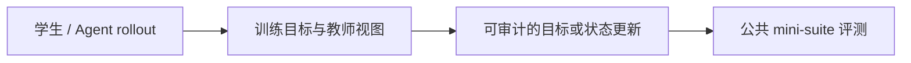
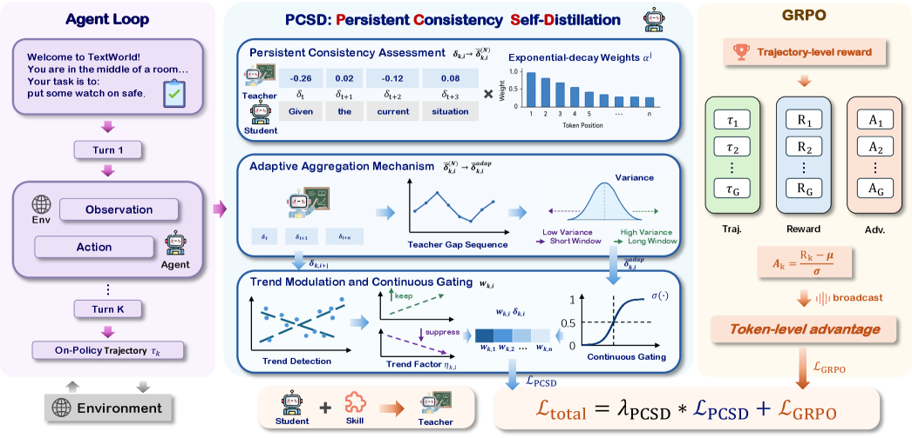

# PCSD：用持续一致性过滤局部教师噪声

> **Fidelity：核心机制复现**。本页把原论文结论、本地机制验证和未复刻部分分开陈述。

## 论文信息

| 字段 | 内容 |
|---|---|
| 论文链接 | [PCSD: Persistent Consistency for Self-Distillation in Agentic Reinforcement Learning（arXiv 2608.01837）](https://arxiv.org/abs/2608.01837) |
| 公司 / 机构 | Chunji Lv 等（按一作归档） |
| 首次公开日期 | 2026-08-03（arXiv v1） |
| 原作者代码 | 未发现/未发布官方代码（核查日期：2026-08-08） |
| 本地 adapter / 方法键 | `pcsd` |
| 本地复现代码 | [`src/auto_research/post_training/`](https://github.com/daiwk/auto-research/tree/main/src/auto_research/post_training/) |

## 原始论文总结

### 背景与主要改动

单 token teacher gap 容易受噪声影响，整步共享权重又会抹掉位置差异。PCSD 在自适应窗口内指数累积 teacher-favoring signal，并对下降趋势衰减，最后用连续 sigmoid gate 与 GRPO 联合训练。



<!-- paper-figure:start -->
### 原论文关键图

[](https://arxiv.org/html/2608.01837v1/x1.png)

> **原论文 Figure 2（关键图）**：展示原论文提出的核心架构、主要模块及其连接关系。图片来自[原论文](https://arxiv.org/abs/2608.01837)，版权归原作者所有；点击图片可查看来源。
<!-- paper-figure:end -->

### 核心公式

$$
s_t=\log\pi_T(y_t)-\log\pi_S(y_t),\quad p_t=\beta p_{t-1}+(1-\beta)s_t,\quad g_t=\sigma(p_t\,m_t),\quad \mathcal L=\mathcal L_{GRPO}+\lambda\sum_tg_t\mathcal L_{OPSD,t}.
$$

### 论文离线与线上效果

ALFWorld 两个 backbone 分别超过 GRPO 15.6/13.3 点，超过 SDAR 6.2/5.5 点；无生产 A/B。

## 本地复现

实现指数持续证据、趋势衰减与连续门控，候选位置作为 token 位置代理。

Arithmetic candidate suite、120 steps、seed 42：accuracy 0.2344 → **0.5625（+140.00%）**。诊断字段完整记录在固定指标文件中。

```bash
auto-research post-train --algorithm pcsd --dataset arithmetic-smoke --maximum-examples 256 --steps 120 --seed 42
auto-research evolve --model post-training --dataset arithmetic-smoke --direction "组合 pcsd 与已安装论文算子" --generations 2 --population 4
```

固定指标见 [`../../experiments/p0-p1-closed-audit-20260808-seed42.json`](../../experiments/p0-p1-closed-audit-20260808-seed42.json)。

## 复现边界

本地使用确定性公共 mini-suite 验证核心状态更新和公平预算，不等同于原论文大模型、多卡 RL、私有环境或完整 benchmark；本地相对变化不得与原文提升混写。
