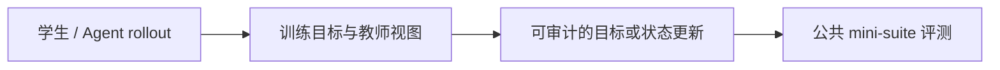
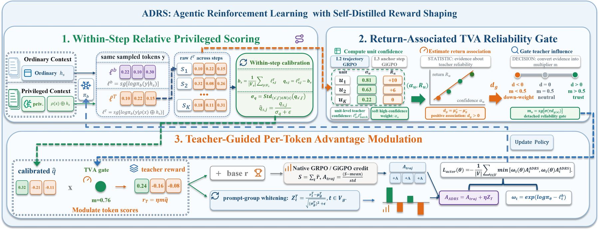

# ADRS：回报相关的自蒸馏奖励塑形

> **Fidelity：核心机制复现**。本页把原论文结论、本地机制验证和未复刻部分分开陈述。

## 论文信息

| 字段 | 内容 |
|---|---|
| 论文链接 | [Agentic Reinforcement Learning with Self-Distilled Reward Shaping（arXiv 2608.03223）](https://arxiv.org/abs/2608.03223) |
| 公司 / 机构 | University of Science and Technology of China / Alibaba Group |
| 首次公开日期 | 2026-08-04（arXiv v1） |
| 原作者代码 | [已开源：gitrxh/ADRS-arxiv](https://github.com/gitrxh/ADRS-arxiv) |
| 本地 adapter / 方法键 | `adrs` |
| 本地复现代码 | [`src/auto_research/post_training/`](https://github.com/daiwk/auto-research/tree/main/src/auto_research/post_training/) |

## 原始论文总结

### 背景与主要改动

privileged teacher 的高置信并不必然与真实任务回报一致。ADRS 在每个交互 step 内标准化教师分数，以教师置信与 realized return 的相关性形成 TVA gate，再把 gated token signal 写入原生 reward-to-advantage 路径，推理时无需技能。



<!-- paper-figure:start -->
### 原论文关键图

[](https://arxiv.org/html/2608.03223v1/figures/framework/ADRS2.jpg)

> **原论文 Figure 2（关键图）**：展示原论文的训练流程与关键优化环节。图片来自[原论文](https://arxiv.org/abs/2608.03223)，版权归原作者所有；点击图片可查看来源。
<!-- paper-figure:end -->

### 核心公式

$$
z_{i,t}=(s_{i,t}-\mu_t)/(\sigma_t+\epsilon),\quad g_t=[\operatorname{corr}(z_{\cdot,t},R)]_+,\quad A'_{i,t}=A_i+\lambda g_tz_{i,t}.
$$

### 论文离线与线上效果

三个交互基准、多个 RL backbone、低数据和未见任务上均持续提升；摘要未给统一单值，且无生产 A/B。

## 本地复现

实现 step 内中心化、return association、TVA gate 与原生 REINFORCE advantage 注入。

Arithmetic candidate suite、120 steps、seed 42：accuracy 0.2344 → **0.6250（+166.67%）**。诊断字段完整记录在固定指标文件中。

```bash
auto-research post-train --algorithm adrs --dataset arithmetic-smoke --maximum-examples 256 --steps 120 --seed 42
auto-research evolve --model post-training --dataset arithmetic-smoke --direction "组合 adrs 与已安装论文算子" --generations 2 --population 4
```

固定指标见 [`../../experiments/p0-p1-closed-audit-20260808-seed42.json`](../../experiments/p0-p1-closed-audit-20260808-seed42.json)。

## 复现边界

本地使用确定性公共 mini-suite 验证核心状态更新和公平预算，不等同于原论文大模型、多卡 RL、私有环境或完整 benchmark；本地相对变化不得与原文提升混写。
