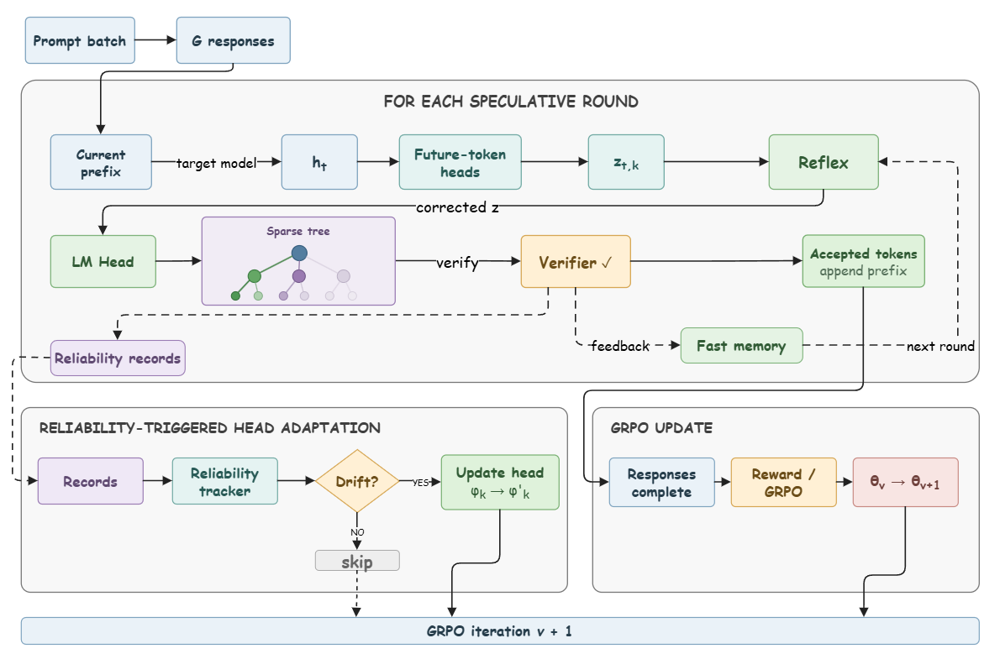

# SpecRoll: Fast-Slow Verifier-Feedback Adaptation for Speculative Reinforcement Learning Rollouts

> **复现级别：核心机制 mini-suite。** 本地实现执行论文特有的 RL rollout 加速 算子；不把确定性小型评测写成论文完整复现。

## 论文信息

| 字段 | 内容 |
|---|---|
| 论文链接 | [arXiv 2608.04962](https://arxiv.org/abs/2608.04962) |
| 公司/机构/学校 | VNU University of Engineering and Technology / Viettel AI |
| 首次公开日期 | 2026-08-05（arXiv v1） |
| 原文开源代码 | 是：[https://anonymous.4open.science/r/SpecRoll-26062006](https://anonymous.4open.science/r/SpecRoll-26062006) |
| Adapter | `specroll` |
| 本地复现代码 | [`src/auto_research/post_training/latest_20260809.py`](https://github.com/daiwk/auto-research/blob/main/src/auto_research/post_training/latest_20260809.py) |

## 原始论文总结

### 背景与主要改动

**主题：RL rollout 加速。** RL 中 target policy 持续变化，静态 drafter 很快过时。SpecRoll 用 future-token heads 提议、Reflex 做无反传的快速隐状态纠偏，并只在持续退化时启动慢速 head 更新；exact verifier 保持采样分布不变。

### 主要架构


<!-- paper-figure:start -->
### 原论文关键图

[](https://arxiv.org/html/2608.04962v1/figures/overview.png)

> **原论文 Figure 2（关键图）**：展示原论文方法的总体设计和关键组成。图片来自[原论文](https://arxiv.org/abs/2608.04962)，版权归原作者所有；点击图片可查看来源。
<!-- paper-figure:end -->

### 核心公式

$\alpha=\min(1,p_\theta(y)/q_\phi(y)),\qquad \mathcal L_{GRPO}\ \text{unchanged}$

### 论文离线效果

5 个 1.5B–14B 模型、3 个数学数据集上生成加速 1.26×–2.15×，端到端加速 1.21×–2.04×。

## 本地复现

稳定指标保存在本论文目录的 [`metrics/arithmetic-smoke-seed42.json`](metrics/arithmetic-smoke-seed42.json)，不提交 checkpoint 或原始运行目录。

```bash
auto-research post-train --algorithm specroll --dataset arithmetic-smoke --steps 120 --seed 42
```

> **本地对照口径**：`specroll` 与同一公开 mini-suite 的无该机制控制组比较；仅报告本地产物中的指标，不把原文大模型/真实环境结果移植为本地提升。

## 复现边界

- 复现论文特有的状态、信用或选择算子，而非只改方法名。
- 未运行原文大模型、专有环境或昂贵 judge；这些缺口不会标注为“已接入”。
- `specroll` 已加入统一 evolve 候选发现；组合 genome 仍受公共评测与预算约束。
