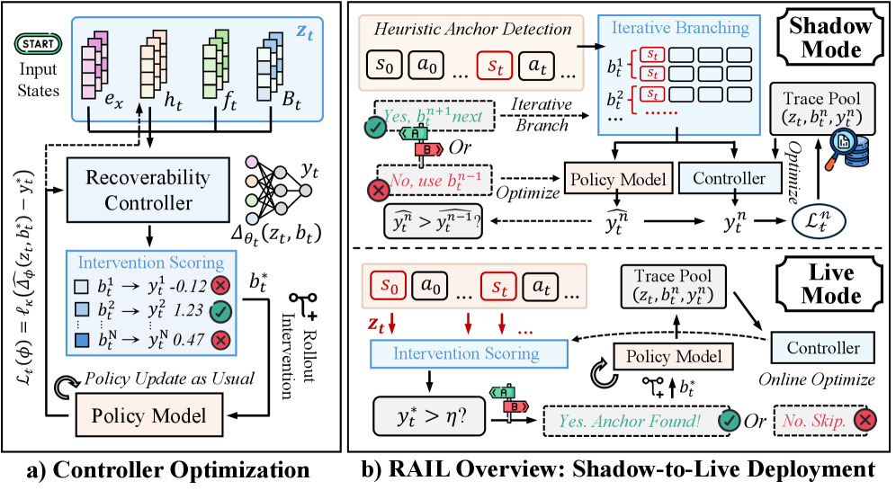

# Optimizing What Policies Learn From: Recoverability-Aware Rollout Intervention Learning

> **复现级别：核心机制 mini-suite。** 本地实现执行论文特有的 rollout 预算分配 算子；不把确定性小型评测写成论文完整复现。

## 论文信息

| 字段 | 内容 |
|---|---|
| 论文链接 | [arXiv 2608.05080](https://arxiv.org/abs/2608.05080) |
| 公司/机构/学校 | University of Notre Dame / Amazon |
| 首次公开日期 | 2026-08-05（arXiv v1） |
| 原文开源代码 | 否：未发现原作者公开代码（核查日期：2026-08-09） |
| Adapter | `rail` |
| 本地复现代码 | [`src/auto_research/post_training/latest_20260809.py`](https://github.com/daiwk/auto-research/blob/main/src/auto_research/post_training/latest_20260809.py) |

## 原始论文总结

### 背景与主要改动

**主题：rollout 预算分配。** 均匀 rollout 浪费预算，静态启发式又跟不上策略变化。RAIL 把干预位置与方式视为 contextual bandit，并通过 shadow-to-live 轨迹学习 recoverability controller。

### 主要架构


<!-- paper-figure:start -->
### 原论文关键图

[](https://arxiv.org/html/2608.05080v1/x2.png)

> **原论文 Figure 2（关键图）**：展示原论文提出的核心架构、主要模块及其连接关系。图片来自[原论文](https://arxiv.org/abs/2608.05080)，版权归原作者所有；点击图片可查看来源。
<!-- paper-figure:end -->

### 核心公式

$a^*(s)=\arg\max_a\mathbb E[\Delta R_{recover}(s,a)-\lambda C(a)]$

### 论文离线效果

在约束 rollout 预算下持续优于均匀 GRPO 及自适应基线；论文摘要未给统一单一提升值。

## 本地复现

稳定指标保存在本论文目录的 [`metrics/arithmetic-smoke-seed42.json`](metrics/arithmetic-smoke-seed42.json)，不提交 checkpoint 或原始运行目录。

```bash
auto-research post-train --algorithm rail --dataset arithmetic-smoke --steps 120 --seed 42
```

> **本地对照口径**：`rail` 与同一公开 mini-suite 的无该机制控制组比较；仅报告本地产物中的指标，不把原文大模型/真实环境结果移植为本地提升。

## 复现边界

- 复现论文特有的状态、信用或选择算子，而非只改方法名。
- 未运行原文大模型、专有环境或昂贵 judge；这些缺口不会标注为“已接入”。
- `rail` 已加入统一 evolve 候选发现；组合 genome 仍受公共评测与预算约束。
