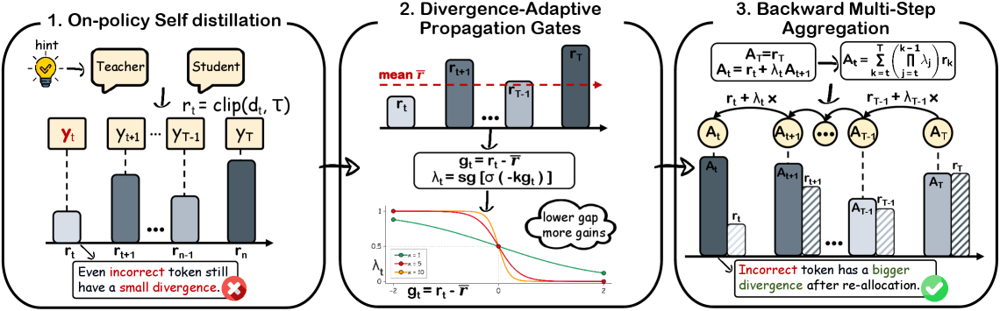

# DASH：动态自适应自蒸馏 Horizon

> **Fidelity：核心机制复现**。实现局部散度裁剪、stop-gradient gate 与反向 horizon 聚合；候选位置代理 token 位置。

## 论文信息

| 字段 | 内容 |
|---|---|
| 论文链接 | [DASH（arXiv 2608.06243）](https://arxiv.org/abs/2608.06243) |
| 公司 / 机构 | Nanjing University |
| 首次公开日期 | 2026-08-06（arXiv v1） |
| 原作者代码 | [已开源：DBtxy/DASH-OPSD](https://github.com/DBtxy/DASH-OPSD) |
| 本地 adapter / 算法键 | `dash` |
| 本地复现代码 | [`src/auto_research/post_training/`](https://github.com/daiwk/auto-research/tree/main/src/auto_research/post_training/) |

## 原始论文总结

### 背景与主要改动

普通 OPSD 对每个 token 独立匹配 privileged teacher，难把后续可靠推理对前面决策的信用传回去。DASH 由局部 teacher/student divergence 产生停止梯度 gate，再从后向前递推聚合权重；不增加 teacher forward pass，却获得自适应 distillation horizon。


<!-- paper-figure:start -->
### 原论文关键图

[](https://arxiv.org/html/2608.06243v1/x4.png)

> **原论文 Figure 2（关键图）**：展示原论文方法的总体设计和关键组成。图片来自[原论文](https://arxiv.org/abs/2608.06243)，版权归原作者所有；点击图片可查看来源。
<!-- paper-figure:end -->

### 核心公式

$$
\lambda_t=\operatorname{sg}\sigma[-\kappa(d_t-\bar d)],\qquad
A_t=d_t+\lambda_t A_{t+1},\qquad \mathcal L=\frac1T\sum_t A_t.
$$

### 论文离线与线上效果

Qwen3-1.7B 平均分 45.07（OPSD 41.87）；4B 为 65.00（63.60）；8B 为 66.40（64.80）。论文没有生产 A/B。

## 本地复现

Arithmetic candidate suite、120 steps、seed 42：accuracy 0.2344 → **0.5781（+146.67%）**，最后 gate mean 0.4822、平均 horizon coefficient 1.5617、额外 teacher forward 为 0。

```bash
auto-research post-train --algorithm dash --dataset arithmetic-smoke --maximum-examples 256 --steps 120 --seed 42
auto-research evolve --model post-training --dataset arithmetic-smoke --direction "比较 OPSD 与 DASH 自适应 horizon" --generations 2 --population 4
```

固定指标见 [`../../experiments/dash-arithmetic-seed42.json`](../../experiments/dash-arithmetic-seed42.json)。

## 复现边界

候选位置不是完整 token trajectory；未复刻 Qwen3、数学推理语料和多卡训练。
