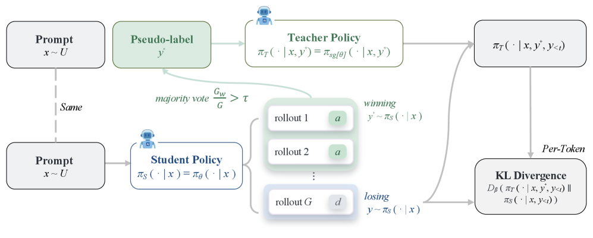

# U-OPSD：完全无外部监督的 on-policy 自蒸馏

> **Fidelity：核心机制复现**。本页把原论文结论、本地机制验证和未复刻部分分开陈述。

## 论文信息

| 字段 | 内容 |
|---|---|
| 论文链接 | [On-Policy Self-Distillation without Any Supervision（arXiv 2608.06296）](https://arxiv.org/abs/2608.06296) |
| 公司 / 机构 | Yijiang Li 等（按一作归档） |
| 首次公开日期 | 2026-08-06（arXiv v1） |
| 原作者代码 | 未发现/未发布官方代码（核查日期：2026-08-08） |
| 本地 adapter / 方法键 | `u-opsd` |
| 本地复现代码 | [`src/auto_research/post_training/`](https://github.com/daiwk/auto-research/tree/main/src/auto_research/post_training/) |

## 原始论文总结

### 背景与主要改动

U-OPSD 不使用答案、环境奖励或更大教师。模型多次采样后做多数投票，以最短一致解作为 privileged view，定点修复最长且高置信错误轨迹，是真正依赖内部一致性的自蒸馏。


<!-- paper-figure:start -->
### 原论文关键图

[](https://arxiv.org/html/2608.06296v1/x2.png)

> **原论文 Figure 2（关键图）**：展示原论文方法的总体设计和关键组成。图片来自[原论文](https://arxiv.org/abs/2608.06296)，版权归原作者所有；点击图片可查看来源。
<!-- paper-figure:end -->

### 核心公式

$$
\hat y=\operatorname{mode}\{y^{(k)}\}_{k=1}^K,\quad c=K^{-1}\sum_k\mathbf1[y^{(k)}=\hat y],\quad \mathcal L=\mathbf1[c\ge\tau]\operatorname{KL}(\pi(\cdot|x,\hat y)\Vert\pi(\cdot|x)).
$$

### 论文离线与线上效果

Qwen3 非 thinking 4B/8B 相对 base 平均提升 8.5/10.7 个点，并平均超过 OPSD 3.2/2.3 个点。无生产 A/B。

## 本地复现

实现多 rollout 自一致投票、置信门控与无 gold 伪教师；公开算术 mini-suite 上该无监督假设并不成立，因此如实记录退化结果。

Arithmetic candidate suite、120 steps、seed 42：accuracy 0.2344 → **0.0938（-60.00%）**。诊断字段完整记录在固定指标文件中。

```bash
auto-research post-train --algorithm u-opsd --dataset arithmetic-smoke --maximum-examples 256 --steps 120 --seed 42
auto-research evolve --model post-training --dataset arithmetic-smoke --direction "组合 u-opsd 与已安装论文算子" --generations 2 --population 4
```

固定指标见 [`../../experiments/p0-p1-closed-audit-20260808-seed42.json`](../../experiments/p0-p1-closed-audit-20260808-seed42.json)。

## 复现边界

本地使用确定性公共 mini-suite 验证核心状态更新和公平预算，不等同于原论文大模型、多卡 RL、私有环境或完整 benchmark；本地相对变化不得与原文提升混写。
