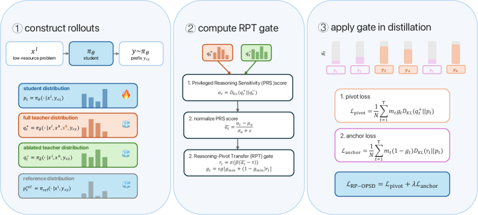

# RP-OPSD：围绕推理枢纽做多语种能力迁移

> **Fidelity：核心机制复现**。本页把原论文结论、本地机制验证和未复刻部分分开陈述。

## 论文信息

| 字段 | 内容 |
|---|---|
| 论文链接 | [RP-OPSD: Reasoning-Pivot-Guided On-Policy Self-Distillation for Multilingual Reasoning Transfer（arXiv 2608.06347）](https://arxiv.org/abs/2608.06347) |
| 公司 / 机构 | Nanjing University / Xinye Wang |
| 首次公开日期 | 2026-08-06（arXiv v1） |
| 原作者代码 | [已开源：NJUNLP/RP-OPSD](https://github.com/NJUNLP/RP-OPSD) |
| 本地 adapter / 方法键 | `rp-opsd` |
| 本地复现代码 | [`src/auto_research/post_training/`](https://github.com/daiwk/auto-research/tree/main/src/auto_research/post_training/) |

## 原始论文总结

### 背景与主要改动

跨语言迁移中，表面措辞与真正改变推理状态的 pivot 不应同权。RP-OPSD 比较带英文参考解与去掉参考解的匹配教师视图，用分布位移定位 pivot，再在这些位置强化 privileged distillation 并保留 reference anchor。


<!-- paper-figure:start -->
### 原论文关键图

[](https://arxiv.org/html/2608.06347v1/x2.png)

> **原论文 Figure 2（关键图）**：展示原论文的整体流程、关键阶段及其数据流向。图片来自[原论文](https://arxiv.org/abs/2608.06347)，版权归原作者所有；点击图片可查看来源。
<!-- paper-figure:end -->

### 核心公式

$$
g_t=\operatorname{norm}(|\log\pi_T(\cdot|r)-\log\pi_T(\cdot|\varnothing)|),\quad q_t=(1-g_t)\pi_S+g_t\pi_T^r,\quad \mathcal L=\sum_t\operatorname{CE}(q_t,\pi_S).
$$

### 论文离线与线上效果

覆盖 17 种语言和多难度数学基准，整体超过强多语推理基线与 OPSD 变体；论文无生产 A/B。

## 本地复现

实现 reference-conditioned / ablated 双视图、pivot gate 与 reference anchor。

Arithmetic candidate suite、120 steps、seed 42：accuracy 0.2344 → **0.5938（+153.33%）**。诊断字段完整记录在固定指标文件中。

```bash
auto-research post-train --algorithm rp-opsd --dataset arithmetic-smoke --maximum-examples 256 --steps 120 --seed 42
auto-research evolve --model post-training --dataset arithmetic-smoke --direction "组合 rp-opsd 与已安装论文算子" --generations 2 --population 4
```

固定指标见 [`../../experiments/p0-p1-closed-audit-20260808-seed42.json`](../../experiments/p0-p1-closed-audit-20260808-seed42.json)。

## 复现边界

本地使用确定性公共 mini-suite 验证核心状态更新和公平预算，不等同于原论文大模型、多卡 RL、私有环境或完整 benchmark；本地相对变化不得与原文提升混写。
