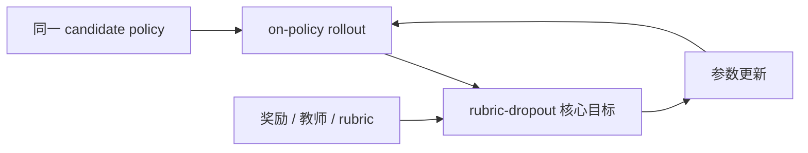
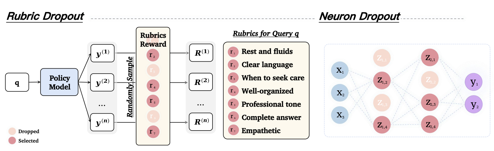

# Rubric Dropout: A Simple Way to Mitigate Reward Hacking in Rubric-as-Reward RL

> **复现级别：核心目标 candidate-policy mini-suite。** 本地真实执行该论文独有的 advantage、蒸馏或约束更新；不是论文大模型训练的数值复刻。

## 论文信息

| 字段 | 内容 |
|---|---|
| 论文链接 | [arXiv 2608.11669](https://arxiv.org/abs/2608.11669) |
| 公司 / 机构 | Scale AI |
| 第一作者 | Minglai Yang |
| 首次公开日期 | 2026-08-12（arXiv v1） |
| 原作者代码 | 未发现原作者公开代码（截至 2026-08-24） |
| 本地 adapter / 方法 | `rubric-dropout` |
| 本地复现代码 | `src/auto_research/post_training/historical_b08_b09.py` |

## 原始论文总结

### 背景与主要改动

每个 rollout group 共享随机丢弃的 rubric 子集，使策略无法持续利用固定 judge proxy。



<!-- paper-figure:start -->
### 原论文关键图

[](https://arxiv.org/html/2608.11669v1/final.png)

> **原论文 Figure 1（关键图）**：展示原论文的训练流程与关键优化环节。图片来自[原论文](https://arxiv.org/abs/2608.11669)，版权归原作者所有；点击图片可查看来源。
<!-- paper-figure:end -->

### 核心公式

$$
R_{drop}(y)=\sum_k m_kr_k(y),\quad m_k\sim Bernoulli(1-p)
$$

### 论文离线与线上效果

30–50% dropout 在 OOD gold judge 上提升 HealthBench-Hard 1–2 points、ResearchQA 6–7 points。 以上为原论文报告值；论文没有工业线上 A/B 时不作线上效果推断。

## 本地复现

同一 arithmetic-smoke candidate policy 运行 120 次更新：训练前 accuracy `0.1953`，训练后 `0.2812`，变化 `+0.0859`。这是训练前后 smoke 结果，不表示相对其他 RL/OPD 算法的公平优势。单篇原始指标见 [`metrics/arithmetic-smoke-seed42.json`](metrics/arithmetic-smoke-seed42.json)，批次索引见 [`../../experiments/historical-b07-b11-seed42.json`](../../experiments/historical-b07-b11-seed42.json)。

```bash
auto-research post-train --algorithm rubric-dropout --dataset arithmetic-smoke --steps 120 --seed 42 --no-network
```

## 复现边界

本地策略是可审计 candidate-policy，复现论文的核心 objective 和诊断量；未下载论文大模型 checkpoint，未声称复刻其完整数据、算力、多 seed 或 benchmark。运行产物默认写入 `runs/post-training/`，仓库只提交指标，不提交 checkpoint。另见 [`../../experiments/`](../../experiments/)。
