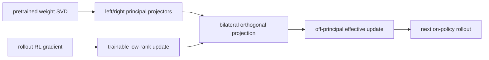
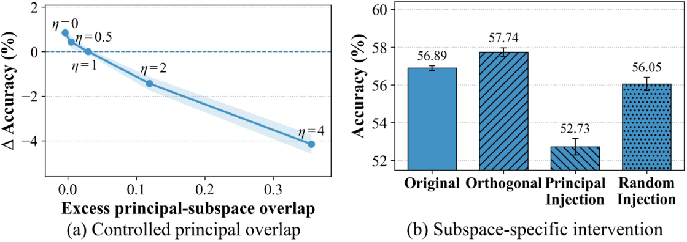

# GCPO：用双侧正交约束稳定 Rollout RL

> **复现级别：核心机制 mini-suite。** 本地实际计算 rollout update 的主子空间重合，并把 policy update 投影到互补子空间；线性策略不是论文矩阵层的完整双侧 LoRA。

## 论文信息

| 字段 | 内容 |
|---|---|
| 论文链接 | [arXiv 2608.11674](https://arxiv.org/abs/2608.11674) |
| 公司 / 机构 | Shanghai AI Laboratory |
| 首次公开日期 | 2026-08-12（arXiv v1） |
| 原作者代码 | 是：[GCPO](https://github.com/Icarus1411/GCPO) |
| 本地 adapter / 方法 | `gcpo` |
| 本地复现代码 | [`src/auto_research/post_training/latest_20260824.py`](https://github.com/daiwk/auto-research/blob/main/src/auto_research/post_training/latest_20260824.py) |

## 原始论文总结

### 背景与主要改动

GRPO 等 on-policy rollout RL 会偶发进入预训练权重的主奇异子空间，论文观察到这些 spike 常先于验证性能下降。GCPO 固定预训练矩阵两侧的 top-k 奇异空间，只允许低秩更新存在于输入、输出两侧的正交补中；这是硬可行域，不是依赖系数的软 penalty。



<!-- paper-figure:start -->
### 原论文关键图

[](https://arxiv.org/html/2608.11674v1/principal_intervention_combined.png)

> **原论文 Figure 2（关键图）**：展示原论文方法的总体设计和关键组成。图片来自[原论文](https://arxiv.org/abs/2608.11674)，版权归原作者所有；点击图片可查看来源。
<!-- paper-figure:end -->

### 核心公式

$$
\delta W=\Pi_\Phi^\perp\delta W\Pi_\Psi^\perp,
\qquad
\delta W=\alpha\Pi_\Phi^\perp LR\Pi_\Psi^\perp.
$$

因此 $\Phi_k^\top\delta W=0$ 且 $\delta W\Psi_k=0$，主映射不会被 rollout 更新覆盖。

### 论文离线与线上效果

Qwen3-8B 与 GLM4-9B 的数学、代码、工具任务上，GCPO 相对 base 最多 `+27.69` points、相对最强基线最多 `+2.37` points。MATH500 双侧 hard constraint 为 `74.56`，无约束为 `72.34`；论文不涉及工业线上 A/B。

## 本地复现

> **本地对照口径**：基线为同一随机初始化 candidate policy 训练前；实验组运行 120 次 GCPO projected update。accuracy 从 `0.1953` 到 `0.6328`，相对 **+224.00%**；这是训练前后变化，不是对 GRPO 的公平优越性结论。

最后一步移除的 principal overlap 为 `0.9956`，projected gradient norm `0.0351`。单篇稳定指标见 [`metrics/arithmetic-smoke-seed42.json`](metrics/arithmetic-smoke-seed42.json)，本批次统一索引见 [`../../experiments/recent-papers-20260824-seed42.json`](../../experiments/recent-papers-20260824-seed42.json)。

```bash
auto-research post-train --algorithm gcpo --dataset arithmetic-smoke --steps 120 --seed 42
```

## 复现边界

本地 policy 参数是向量，因此以 empirical update covariance 的主右奇异空间实现等价正交限制；未声称复刻 Qwen3-8B/GLM4-9B 的逐层矩阵双侧 LoRA、三 seed 或论文 benchmark。
