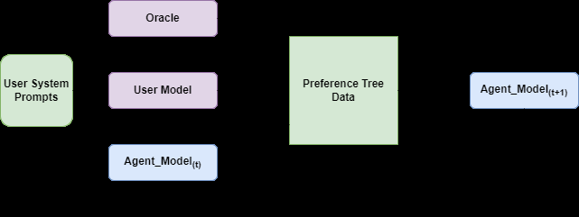

# Preference Tree Optimization：用前瞻模拟生成长期偏好

> **复现级别：核心机制 mini-suite。** 本地实际构造 preference tree、oracle 排序与 look-ahead advantage；不冒充论文的心理咨询模型实验。

## 论文信息

| 字段 | 内容 |
|---|---|
| 论文链接 | [arXiv 2608.12062](https://arxiv.org/abs/2608.12062) |
| 公司 / 机构 | Reichman University |
| 首次公开日期 | 2026-08-12（arXiv v1） |
| 原作者代码 | 否：未发现原作者公开代码（核查日期：2026-08-13） |
| 本地 adapter / 方法 | `pto` |
| 本地复现代码 | [`src/auto_research/post_training/latest_20260813.py`](https://github.com/daiwk/auto-research/blob/main/src/auto_research/post_training/latest_20260813.py) |

## 原始论文总结

### 背景与主要改动

逐轮偏好只判断当前回答，难以优化目标导向对话的长期结果。PTO 让 agent 和虚拟用户展开候选对话树，oracle 评价当前回答及未来延续，以偏好对迭代执行 DPO；更深 look-ahead 带来更稳定的长期策略。


<!-- paper-figure:start -->
### 原论文关键图

[](https://arxiv.org/html/2608.12062v1/fig_framework.png)

> **原论文 Figure 1（关键图）**：展示原论文提出的核心架构、主要模块及其连接关系。图片来自[原论文](https://arxiv.org/abs/2608.12062)，版权归原作者所有；点击图片可查看来源。
<!-- paper-figure:end -->

### 核心公式

$$
r^{LA}(a_t)=r(a_t)+\gamma\max_{a_{t+1:t+K}}R(\tau),\qquad
\mathcal L_{PTO}=\mathcal L_{DPO}(y_w,y_l\mid h_t).
$$

### 论文离线与线上效果

Llama-2-7B 基线 Final Score 为 3.453；look-ahead depth 5 的最佳模型为 3.982，同时 Session Satisfaction 4.190、Working Alliance 3.775。
论文报告离线虚拟心理咨询用户评测，没有工业线上 A/B。

## 本地复现

120 steps 的 arithmetic mini-suite 中，初始 accuracy 0.1953，PTO 路径为 0.4453；最后一步实际记录 12 个 tree nodes、6 次 oracle comparison、look-ahead depth 1。该单 seed 小任务只验证优化算子。

```bash
auto-research post-train --algorithm pto --dataset arithmetic-smoke --steps 120 --seed 42
```

稳定指标见 [`metrics/arithmetic-smoke-seed42.json`](metrics/arithmetic-smoke-seed42.json)。
本轮跨主题运行入口见 [`mr7-latest-20260813-seed42.json`](../../experiments/mr7-latest-20260813-seed42.json)；该文件只索引各论文独立指标，不复制指标值。

## 复现边界

未运行 Llama-2-7B、虚拟心理咨询患者或 LLM oracle；本地 deterministic reward 仅替代昂贵 evaluator，偏好树与前瞻信用路径实际执行。
