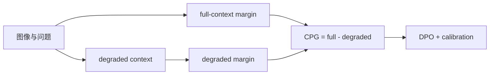
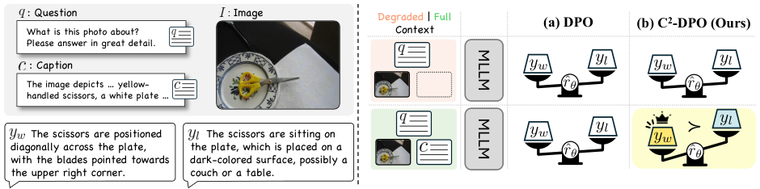

# C²-DPO：以上下文偏好增益抑制多模态幻觉

> **复现级别：核心机制 mini-suite。** 实际计算 full/degraded context 的 Contextual Preference Gain 并参与偏好更新；不把候选策略模型写成完整 MLLM 微调。

## 论文信息

| 字段 | 内容 |
|---|---|
| 论文链接 | [arXiv 2608.12158](https://arxiv.org/abs/2608.12158) |
| 公司 / 机构 | Korea University（第一作者第一署名单位；合作 KAIST） |
| 首次公开日期 | 2026-08-12（arXiv v1） |
| 原作者代码 | 是：[mlvlab/C2-DPO](https://github.com/mlvlab/C2-DPO) |
| 本地 adapter / 方法 | `c2-dpo` |
| 本地复现代码 | [`src/auto_research/post_training/latest_20260813.py`](https://github.com/daiwk/auto-research/blob/main/src/auto_research/post_training/latest_20260813.py) |

## 原始论文总结

### 背景与主要改动

普通 DPO 即使输入相关图像上下文，也可能主要依赖语言先验。论文先定义 CPG，度量加入上下文后 chosen/rejected preference margin 增加多少；C²-DPO 直接扩大该增益，同时保留原偏好顺序。



<!-- paper-figure:start -->
### 原论文关键图

[](https://arxiv.org/html/2608.12158v1/figure1_motivation.png)

> **原论文 Figure 1（关键图）**：展示原论文方法的总体设计和关键组成。图片来自[原论文](https://arxiv.org/abs/2608.12158)，版权归原作者所有；点击图片可查看来源。
<!-- paper-figure:end -->

### 核心公式

$$
\operatorname{CPG}=\Delta_\theta(y_w,y_l\mid x,c)-\Delta_\theta(y_w,y_l\mid x,\tilde c),\qquad
\mathcal L_{C^2\text{-DPO}}=\mathcal L_{DPO}-\lambda\operatorname{CPG}.
$$

### 论文离线与线上效果

Qwen2-VL-Instruct-2B 在 Object HalBench 的 response-level hallucination 降到 1.6，相对 C-DPO 减少 **36%**；mention-level 降到 1.0（相对减少 60%），AMBER hallucination score 为 16.1，且未牺牲通用多模态推理。
论文报告公开 benchmark，没有工业线上 A/B。

## 本地复现

120 steps arithmetic mini-suite：accuracy 0.1953→0.6719；末步 CPG 0.05844，执行 2 个 preference pairs。该结果只说明校准梯度能运行，不代表 Object HalBench 复现。

```bash
auto-research post-train --algorithm c2-dpo --dataset arithmetic-smoke --steps 120 --seed 42
```

稳定指标见 [`metrics/arithmetic-smoke-seed42.json`](metrics/arithmetic-smoke-seed42.json)。
本轮跨主题运行入口见 [`mr7-latest-20260813-seed42.json`](../../experiments/mr7-latest-20260813-seed42.json)；该文件只索引各论文独立指标，不复制指标值。

## 复现边界

尚未下载 Qwen2-VL、SENTINEL 与 Object HalBench 做完整微调；MR7 同时提供 checkpoint matrix / lmms-eval 基础设施，后续可把该目标接入真实 MLLM 训练。
