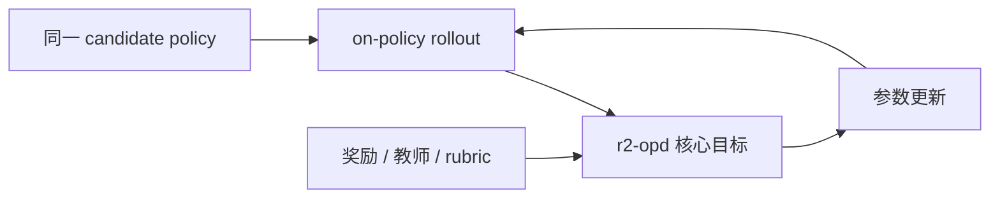
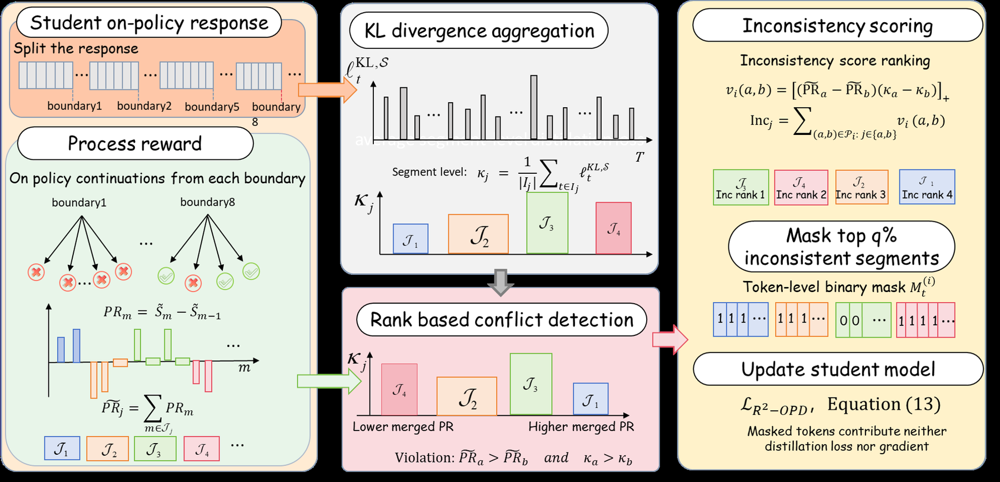

# Beyond Imitation: Filtering On-Policy Distillation by Reasoning Progress

> **复现级别：核心目标 candidate-policy mini-suite。** 本地真实执行该论文独有的 advantage、蒸馏或约束更新；不是论文大模型训练的数值复刻。

## 论文信息

| 字段 | 内容 |
|---|---|
| 论文链接 | [arXiv 2608.19408](https://arxiv.org/abs/2608.19408) |
| 公司 / 机构 | Authors did not disclose affiliation |
| 第一作者 | Chen Yang |
| 首次公开日期 | 2026-08-19（arXiv v1） |
| 原作者代码 | 未发现原作者公开代码（截至 2026-08-24） |
| 本地 adapter / 方法 | `r2-opd` |
| 本地复现代码 | `src/auto_research/post_training/historical_b08_b09.py` |

## 原始论文总结

### 背景与主要改动

分别按教师奖励和独立进展奖励排序 reasoning spans，冲突时屏蔽蒸馏信号。



<!-- paper-figure:start -->
### 原论文关键图

[](https://arxiv.org/html/2608.19408v1/Figures/reasoning_progress_aware_reward_filtering_for_OPD.png)

> **原论文 Figure 3（关键图）**：展示原论文方法的总体设计和关键组成。图片来自[原论文](https://arxiv.org/abs/2608.19408)，版权归原作者所有；点击图片可查看来源。
<!-- paper-figure:end -->

### 核心公式

$$
A_i^{R^2}=A_i^{OPD}\mathbf1[\operatorname{rank}(r_i^T)=\operatorname{rank}(r_i^P)]
$$

### 论文离线与线上效果

论文报告在多个 reasoning benchmark 上稳定优于标准 OPD，困难任务收益更明显。 以上为原论文报告值；论文没有工业线上 A/B 时不作线上效果推断。

## 本地复现

同一 arithmetic-smoke candidate policy 运行 120 次更新：训练前 accuracy `0.1953`，训练后 `0.6641`，变化 `+0.4688`。这是训练前后 smoke 结果，不表示相对其他 RL/OPD 算法的公平优势。单篇原始指标见 [`metrics/arithmetic-smoke-seed42.json`](metrics/arithmetic-smoke-seed42.json)，批次索引见 [`../../experiments/historical-b07-b11-seed42.json`](../../experiments/historical-b07-b11-seed42.json)。

```bash
auto-research post-train --algorithm r2-opd --dataset arithmetic-smoke --steps 120 --seed 42 --no-network
```

## 复现边界

本地策略是可审计 candidate-policy，复现论文的核心 objective 和诊断量；未下载论文大模型 checkpoint，未声称复刻其完整数据、算力、多 seed 或 benchmark。运行产物默认写入 `runs/post-training/`，仓库只提交指标，不提交 checkpoint。另见 [`../../experiments/`](../../experiments/)。
